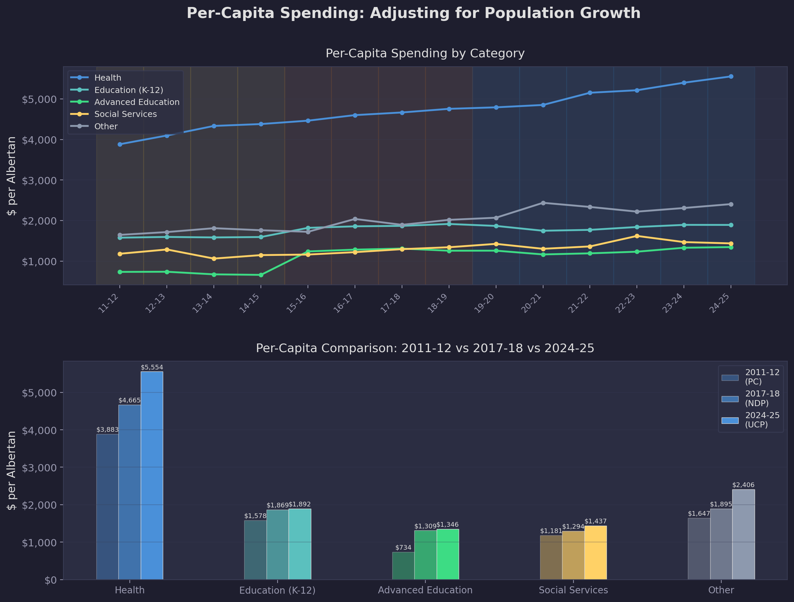
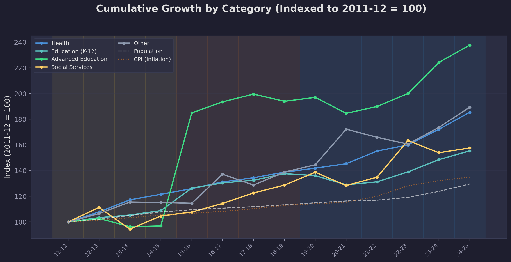
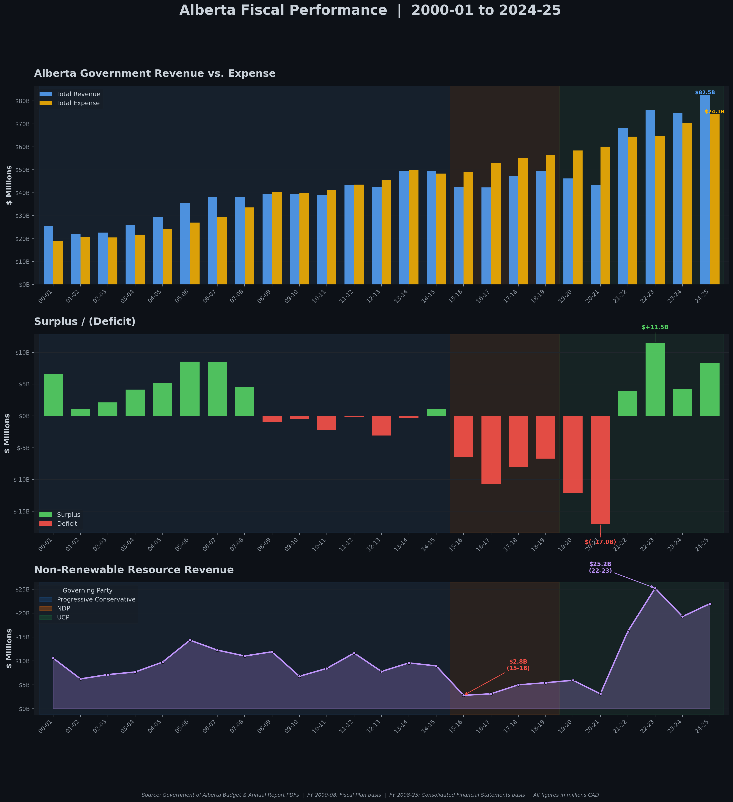

# Alberta Operating Expense Analysis: Fiscal Years 2011-12 to 2024-25

**Prepared by:** Kacper Ruta
**Date:** February 2026
**Scope:** Government of Alberta — Ministry-level operating expense trends, normalized for population growth and inflation

---

## Executive Summary

This report examines 14 fiscal years of Alberta's operating expenditures (2011-12 through 2024-25), drawing on ministry-level data extracted from official provincial budget documents and supplemented with population and consumer price data from Statistics Canada.

Over this period, total nominal operating expense rose from $34.2 billion to $62.0 billion, an increase of 81.5%. However, when adjusting for both population growth (29.6%) and inflation (34.9% cumulative CPI increase), real per-capita operating expenditure increased by only 3.8% — from $12,176 to $12,635 in constant 2024-25 dollars. This finding suggests that the substantial nominal growth in provincial spending has been driven overwhelmingly by demographic expansion and rising costs, rather than by an expansion in the level of government services delivered to each Albertan.

Health expenditure continues to represent the single largest component of the operating budget, growing from 43.0% to 44.0% of total spending. Meanwhile, K-12 Education's share has contracted from 17.5% to 15.0%, raising questions about the adequacy of per-student funding in the context of rapid population growth.

> **Note on data:** Figures for fiscal year 2024-25 are budget estimates. The most recent audited actuals available are from 2023-24 ($58.1 billion, real per-capita: $12,401, representing a 1.8% real increase over 2011-12).

---

## Table of Contents

1. [Background and Objective](#1-background-and-objective)
2. [Summary of Findings](#2-summary-of-findings)
3. [Real Per-Capita Calculation](#3-real-per-capita-calculation)
4. [Expenditure Composition by Category](#4-expenditure-composition-by-category)
5. [Per-Capita Expenditure Trends](#5-per-capita-expenditure-trends)
6. [Inflation-Adjusted (Real) Expenditure](#6-inflation-adjusted-real-expenditure)
7. [Health Expenditure Analysis](#7-health-expenditure-analysis)
8. [Cumulative Growth by Category](#8-cumulative-growth-by-category)
9. [Fiscal Context: Revenue, Expense, and Surplus/Deficit](#9-fiscal-context-revenue-expense-and-surplusdeficit)
10. [Data Sources and Methodology](#10-data-sources-and-methodology)
11. [Limitations and Caveats](#11-limitations-and-caveats)
12. [Technical Appendix](#12-technical-appendix)

---

## 1. Background and Objective

Alberta's provincial budget is subject to frequent public discussion, particularly regarding the pace of spending growth and the allocation of resources across ministries. Headline figures — such as the increase from $34 billion to $62 billion in annual operating expense — can be difficult to interpret without controlling for two confounding factors:

- **Population growth:** Alberta's population grew from 3.79 million to 4.91 million over the study period, a 29.6% increase driven by interprovincial migration and international immigration.
- **Inflation:** The Alberta Consumer Price Index rose from 119.9 to 161.8 (2002 base), representing a 34.9% cumulative increase in the cost of goods and services.

The objective of this analysis is to decompose Alberta's operating expenditure trends into their underlying drivers and to present spending data on a consistent, comparable basis across 14 fiscal years and three governing administrations (Progressive Conservative, New Democratic, and United Conservative parties).

To enable cross-year comparison, approximately 80 distinct ministry names — reflecting frequent government restructuring — were normalized into five stable analytical categories: Health, Education (K-12), Advanced Education, Social Services, and Other.

---

## 2. Summary of Findings

### Table 1: Key Indicators, 2011-12 to 2024-25

| Indicator | 2011-12 | 2024-25 | Change |
|-----------|---------|---------|--------|
| Total Operating Expense (nominal) | $34.2B | $62.0B | +81.5% |
| Alberta Population (July midyear) | 3.79M | 4.91M | +29.6% |
| Alberta CPI (2002=100) | 119.9 | 161.8 | +34.9% |
| Real Per-Capita Spending (2024-25 $) | $12,176 | $12,635 | +3.8% |

### Table 2: Expenditure by Category

| Category | 2011-12 | 2024-25 | Nominal Growth | Share of Total |
|----------|---------|---------|----------------|----------------|
| Health | $14.7B | $27.3B | +85% | 43.0% to 44.0% |
| Education (K-12) | $6.0B | $9.3B | +55% | 17.5% to 15.0% |
| Advanced Education | $2.8B | $6.6B | +138% | 8.1% to 10.7% |
| Social Services | $4.5B | $7.1B | +58% | 13.1% to 11.4% |
| Other | $6.2B | $11.8B | +89% | 18.3% to 19.0% |

### Key Observations

1. **Health expenditure** now represents 44 cents of every operating dollar and continues to grow as a share of the total budget. In nominal terms, per-capita health spending increased from $3,883 to $5,554. However, after adjusting for inflation, the real increase amounts to approximately 6% over the full 14-year period. The COVID-19 pandemic drove a notable acceleration in health expenditure beginning in 2019-20.

2. **K-12 Education** has experienced a relative decline in budget share, falling from 17.5% to 15.0% of total operating expense. While nominal spending grew by 55%, this increase was largely absorbed by population growth and inflation. On a real per-capita basis, K-12 funding has remained effectively flat, which warrants further examination in the context of rising enrolment and classroom resource requirements.

3. **Advanced Education** recorded the largest relative increase at 138% nominal growth, with its budget share rising from 8.1% to 10.7%. This is attributable in part to funding restructuring that shifted certain capital grants into operating budgets, which should be considered when interpreting the trend.

4. **Across governing administrations,** real per-capita spending peaked at $13,712 in fiscal year 2016-17 under the NDP government. Under the UCP government (2019-present), real per-capita spending has declined from that peak. By 2024-25, real per-capita expenditure ($12,635) is below the level recorded in 2015-16 ($13,153), despite the additional fiscal demands of the COVID-19 pandemic during the intervening years.

---

## 3. Real Per-Capita Calculation

The central finding of this report — that real per-capita spending grew by only 3.8% over 14 years — requires a transparent explanation of the underlying methodology.

### 3.1 Input Data

| Variable | 2011-12 | 2024-25 | Source |
|----------|---------|---------|--------|
| Total Operating Expense | $34,175M | $62,026M | Alberta Budget Documents |
| Population | 3,787,705 | 4,909,030 | Statistics Canada, Table 17-10-0009-01 |
| Alberta CPI (2002=100) | 119.9 | 161.8 | Statistics Canada, Table 18-10-0004-01 |

### 3.2 Step 1 — Inflation Adjustment

All nominal values are converted to constant 2024-25 dollars using the Alberta-specific Consumer Price Index. The CPI deflator for each year is calculated as:

```
CPI Deflator = CPI(2024-25) / CPI(year)
```

For 2011-12:

```
Deflator = 161.8 / 119.9 = 1.3494
Real Operating Expense = $34,175M x 1.3494 = $46,118M
```

For 2024-25 (the reference year):

```
Deflator = 161.8 / 161.8 = 1.0000
Real Operating Expense = $62,026M x 1.0 = $62,026M
```

After inflation adjustment, the growth in operating expenditure reduces from 81.5% (nominal) to 34.5% (real).

### 3.3 Step 2 — Population Adjustment

Real expenditure is divided by the provincial population to derive per-capita figures:

```
Real Per-Capita (2011-12) = $46,118M / 3,787,705 = $12,176
Real Per-Capita (2024-25) = $62,026M / 4,909,030 = $12,635
```

### 3.4 Step 3 — Result

```
Percentage Change = ($12,635 / $12,176) - 1 = +3.8%
```

### 3.5 Decomposition of Nominal Growth

The 81.5% nominal increase in operating expenditure can be attributed to three components:

| Component | Contribution |
|-----------|-------------|
| Inflation (CPI: 119.9 to 161.8) | +34.9% |
| Population growth (3.79M to 4.91M) | +29.6% |
| Real per-capita increase | +3.8% |
| **Total (compounded)** | **81.5%** |

This decomposition demonstrates that approximately 95% of the observed nominal spending growth is attributable to price-level changes and demographic expansion, rather than to an increase in per-person service provision.

---

## 4. Expenditure Composition by Category

### Figure 1: Operating Expenditure by Category — Absolute and Proportional


Figure 1 presents two views of Alberta's operating expenditure over the study period.

The upper panel displays absolute spending in billions of dollars, segmented by the five analytical categories. Total operating expenditure grew from approximately $34 billion in 2011-12 to $62 billion in 2024-25. Health (blue) represents the single largest component and has grown both in absolute terms and as a proportion of total spending.

The lower panel displays the same data as a 100% stacked composition, illustrating each category's share of total operating expense over time. Two structural shifts are evident:
- Health's share has increased from 43.0% to 44.0%, with the most pronounced growth occurring after 2019-20.
- K-12 Education's share has contracted from 17.5% to 15.0%, a gradual but persistent trend across all three governing administrations.

Background shading denotes the governing party for each fiscal year: yellow (Progressive Conservative, 2011-2014), orange (NDP, 2015-2018), and blue (UCP, 2019-present).

---

## 5. Per-Capita Expenditure Trends

### Figure 2: Per-Capita Operating Expenditure by Category


Figure 2 adjusts expenditure data for population size, providing a more accurate picture of government service intensity per Albertan.

The upper panel presents per-capita expenditure trends by category. Health per-capita spending exhibits the steepest trajectory, accelerating from 2019-20 onward due to pandemic-related expenditures and sustained post-pandemic health system costs. K-12 Education and Social Services per-capita spending have grown at notably slower rates, with K-12 per-capita expenditure remaining nearly flat across the study period.

The lower panel compares per-capita expenditure across three representative years — one from each governing administration (2011-12 under the PC, 2017-18 under the NDP, and 2024-25 under the UCP) — to illustrate the differing spending priorities of each government on a per-person basis.

---

## 6. Inflation-Adjusted (Real) Expenditure

### Figure 3: Nominal vs. Real Total Operating Expenditure


Figure 3 isolates the effect of inflation on reported expenditure figures.

The upper panel plots both nominal (yellow line) and real (blue line) total operating expense. The shaded area between the two lines represents the cumulative inflation effect — the portion of nominal spending growth that reflects higher prices rather than increased service delivery. By 2024-25, the inflation-adjusted total ($62.0B) is approximately $3.5B less than what it would be if expressed in nominal terms at the real growth trajectory.

The lower panel presents real per-capita expenditure as a bar chart, with bars colour-coded to indicate year-over-year direction: orange bars denote an increase from the prior year (spending grew faster than population and inflation combined), while green bars denote a decrease (spending restraint or efficiency gains exceeded demographic and inflationary pressures).

The most notable feature is the peak of $13,712 per capita in 2016-17, which represents the highest level of real per-person operating expenditure in the study period. Subsequent fiscal consolidation and rapid population growth have brought real per-capita spending down to $12,635 by 2024-25 — a level below that observed in 2015-16 ($13,153).

---

## 7. Health Expenditure Analysis

### Figure 4: Health Spending — Absolute, Proportional, and Per-Capita


Given that Health represents the largest single component of provincial operating expenditure, Figure 4 provides a detailed examination of this category.

The left panel displays Health spending in absolute terms (bars) alongside Health's share of total operating expenditure (yellow line, right axis). Health spending has grown from $14.7 billion to $27.3 billion, while its budget share has fluctuated between approximately 40% and 44%. The share dipped during the NDP government's term — when overall spending rose across multiple categories — before increasing to 44% under the UCP government, driven primarily by pandemic-era health system pressures.

The right panel compares nominal and real Health per-capita expenditure. In nominal terms, Health spending per Albertan nearly doubled from $3,883 to $5,554. However, in constant 2024-25 dollars, the real increase is considerably more modest: from $5,239 to $5,554, representing a real per-capita increase of approximately 6% over 14 years. The widening gap between the nominal and real lines illustrates the degree to which inflation overstates the actual expansion in per-person health service delivery.

---

## 8. Cumulative Growth by Category

### Figure 5: Indexed Growth by Category (2011-12 = 100)


Figure 5 indexes all expenditure categories to a base value of 100 in 2011-12, enabling direct comparison of relative growth trajectories. Two reference lines are included: population growth (white dashed) and cumulative CPI inflation (orange dotted). Categories growing faster than both reference lines represent areas where real per-capita spending has increased; categories growing slower represent effective per-person reductions.

Key observations:

- **Advanced Education** is a clear outlier, reaching an index value of approximately 240 by 2024-25 — well in excess of both population and inflation benchmarks.
- **Health** and **Social Services** followed similar trajectories through 2019-20, after which Health spending accelerated due to COVID-19 pressures while Social Services growth moderated.
- **K-12 Education** has grown only marginally faster than the population line, indicating that per-capita K-12 expenditure has been essentially flat in nominal terms and has declined in real terms.
- The **"Other"** category — comprising Justice, Infrastructure, Transportation, Agriculture, Energy, and remaining ministries — has broadly tracked the combined population-plus-inflation benchmark.

---

## 9. Fiscal Context: Revenue, Expense, and Surplus/Deficit

### Figure 6: Alberta Fiscal Performance, 2000-01 to 2024-25


Figure 6 provides the broader fiscal context within which spending decisions are made. The three panels illustrate:

- **Revenue vs. Expense (top panel):** Total provincial revenue and expense over 25 fiscal years. Revenue is considerably more volatile than expense, driven by fluctuations in non-renewable resource revenue.
- **Surplus/Deficit (middle panel):** The resulting fiscal balance. Alberta has experienced both large surpluses (notably during the mid-2000s resource boom) and deep deficits (particularly following the 2014 oil price collapse and during the COVID-19 pandemic).
- **Non-Renewable Resource Revenue (bottom panel):** The primary source of fiscal volatility. Resource revenue declined sharply from 2014 onward before partially recovering, illustrating the structural challenge of funding growing public services with an inherently cyclical revenue base.

This fiscal context is essential for interpreting the expenditure trends presented in earlier sections. The constraints imposed by revenue volatility help explain why operating expenditure growth has been largely absorbed by population and inflation, with limited room for real per-capita service expansion.

---

## 10. Data Sources and Methodology

### 10.1 Data Sources

| Source | Description |
|--------|-------------|
| [Alberta Budget Documents](https://open.alberta.ca/publications/budget) | 14 official budget PDFs (2011-12 to 2024-25) containing ministry-level operating expense tables |
| [Statistics Canada, Table 17-10-0009-01](https://www150.statcan.gc.ca/t1/tbl1/en/tv.action?pid=1710000901) | Alberta quarterly population estimates; July midyear values used |
| [Statistics Canada, Table 18-10-0004-01](https://www150.statcan.gc.ca/t1/tbl1/en/tv.action?pid=1810000401) | Alberta Consumer Price Index, all-items, annual average (2002=100) |

### 10.2 Ministry Normalization

Alberta restructures its ministry portfolios frequently. Over the 14-year study period, approximately 80 distinct ministry names appear in budget documents. To enable meaningful cross-year comparison, all ministry names were mapped to five stable analytical categories:

- **Health** — Includes Alberta Health, Alberta Health Services, and Mental Health and Addiction
- **Education (K-12)** — Includes the Ministry of Education, school capital, and school operations
- **Advanced Education** — Includes the Ministry of Advanced Education, post-secondary institutions, and student aid programs
- **Social Services** — Includes Human Services, Children and Family Services, Community and Social Services, and Seniors and Housing
- **Other** — Includes Justice and Solicitor General, Infrastructure, Transportation, Agriculture, Energy, Municipal Affairs, Environment, Treasury Board and Finance, Executive Council, and all remaining ministry portfolios

### 10.3 Inflation Adjustment

All real (inflation-adjusted) figures are expressed in constant 2024-25 dollars using Alberta-specific CPI:

```
Real Value = Nominal Value x (CPI_2024-25 / CPI_year)
```

The Alberta provincial CPI is used rather than the national all-items CPI, as provincial price levels can diverge meaningfully from the national average due to differences in housing costs, energy prices, and labour market conditions.

### 10.4 Data Extraction and Validation

Ministry-level operating expenditure data was extracted from budget PDF documents using automated word-level extraction (pdfplumber library) with x-coordinate column analysis to correctly identify tabular data boundaries. All extracted data was validated through three independent checks:

- **Internal consistency:** Extracted ministry subtotals were compared against "Total Operating Expense" rows printed in each budget document. Maximum deviation across all 14 years: 0.01%.
- **Cross-year verification:** Prior-year actual figures reported in each budget were compared against the corresponding year's own budget document to confirm consistency.
- **External ground truth:** Extracted values for 2023-24 and 2024-25 were cross-referenced against pre-extracted Excel-format data from Alberta Treasury Board and Finance.

Special expenditure items — including COVID-19 Response and Recovery expenses (2019-20 through 2022-23), Climate Leadership Plan items (2016-17 through 2018-19), and Crude-by-Rail Transaction costs (2019-20 through 2021-22) — were identified and assigned to their respective analytical categories.

---

## 11. Limitations and Caveats

The following limitations should be considered when interpreting the findings of this analysis:

1. **Budget estimates vs. audited actuals.** Fiscal year 2024-25 figures are budget estimates and may differ from final audited results. All other years use actual (audited) figures as reported in subsequent budget documents.

2. **Category normalization.** The mapping of ministry names to five analytical categories involves judgment, particularly for ministries with cross-cutting mandates (e.g., Community and Social Services, which includes both housing and income support functions). The normalization schema was designed for consistency and comparability, not to reflect the full complexity of ministerial mandates.

3. **Operating expense only.** This analysis examines operating expenditure and excludes capital expenditure, debt servicing, and pension obligations. Total provincial expenditure is higher than the figures presented here.

4. **Advanced Education restructuring.** The substantial growth in the Advanced Education category is attributable in part to accounting changes that moved certain post-secondary capital grants into operating budgets. This structural change complicates direct comparison with earlier years.

5. **CPI as deflator.** The Consumer Price Index may not fully capture the cost pressures facing government service delivery, which is labour-intensive and subject to different cost dynamics than household consumption. A government-specific cost index would be more precise but is not publicly available on a consistent provincial basis.

6. **Population measure.** Midyear (July 1) population estimates are used as the denominator for per-capita calculations. These estimates are subject to revision and may not precisely align with fiscal year boundaries (April 1 to March 31).

---

## 12. Technical Appendix

### Project Structure

```
2011-2025 Expense Analysis/             # This folder
├── README.md                            # This report
├── Alberta_Expense_Analysis.ipynb       # Main analysis notebook (Jupyter)
├── extract_ministry_expenses.py         # PDF extraction and normalization pipeline
├── generate_fiscal_infographic.py       # Revenue/expense/surplus infographic generator
└── plots/                               # Generated figures (Figures 1-6)

Shared resources (at project root):
├── Data/                                # Extracted CSV datasets
│   ├── alberta_surplus_deficit.csv      # 25-year fiscal summary data
│   ├── ministry_expenses.csv            # Aggregated 5-category expenditure data
│   ├── ministry_expenses_detail.csv     # Individual ministry-level values
│   └── ministry_expenses_wide.csv       # Pivoted format (years x categories)
└── Budget PDFs/                         # 14 source budget documents (2011-2025)
```

### Software Requirements

```
pandas
numpy
matplotlib
pdfplumber
```

### Reproduction

To reproduce the analysis, run `extract_ministry_expenses.py` to generate the CSV data files, then execute the Jupyter notebook `Alberta_Expense_Analysis.ipynb` to produce all figures and summary statistics.

---

*This analysis uses publicly available data from the Government of Alberta and Statistics Canada. All figures, calculations, and visualizations are original work. The analysis is non-partisan and is intended to inform public understanding of provincial expenditure trends.*
