# Alberta Fiscal Plan 2026-2029: Revenue, Expense, and Fiscal Sustainability Analysis

**Prepared by:** Kacper Ruta, Policy and Fiscal Analysis
**Date:** February 2026
**Source:** Government of Alberta, Fiscal Plan 2026-29 (February 26, 2026)

---

## Table of Contents

**Part I: Fiscal Overview**
1. [Executive Summary](#executive-summary)
2. [Fiscal Balance Overview](#1-fiscal-balance-overview)

**Part II: Revenue Analysis**
3. [Revenue Outlook](#2-revenue-outlook)
   - 2.1 [Revenue Trajectory](#21-revenue-trajectory)
   - 2.2 [Resource Revenue Risk](#22-resource-revenue-risk)
   - 2.3 [Revenue Composition Shift](#23-revenue-composition-shift)

**Part III: Expense Analysis**
4. [Expense Analysis](#3-expense-analysis)
   - 3.1 [Where the Money Goes](#31-where-the-money-goes)
   - 3.2 [Biggest Spending Changes](#32-biggest-spending-changes)
   - 3.3 [Spending by Policy Area](#33-spending-by-policy-area)
   - 3.4 [Health Spending Deep Dive](#34-health-spending-deep-dive)

**Part IV: Fiscal Gap and Debt**
5. [Revenue vs. Expense Gap](#4-revenue-vs-expense-gap)
6. [Debt and Fiscal Sustainability](#5-debt-and-fiscal-sustainability)
   - 5.1 [Cumulative Deficit and Borrowing](#51-cumulative-deficit-and-borrowing)
   - 5.2 [Debt Trajectory](#52-debt-trajectory)
   - 5.3 [Debt Servicing Cost Escalation](#53-debt-servicing-cost-escalation)

**Part V: Macroeconomic Context**
7. [Macroeconomic Environment](#6-macroeconomic-environment)
   - 6.1 [Oil Price Outlook and Fiscal Sensitivity](#61-oil-price-outlook-and-fiscal-sensitivity)
   - 6.2 [Energy Transition Risks](#62-energy-transition-risks)
   - 6.3 [Population and Demographic Pressures](#63-population-and-demographic-pressures)
   - 6.4 [Interest Rate Environment and Debt Cost Sensitivity](#64-interest-rate-environment-and-debt-cost-sensitivity)

**Part VI: Comparative Analysis**
8. [Interprovincial Fiscal Comparison](#7-interprovincial-fiscal-comparison)
   - 7.1 [Revenue Structure Comparison](#71-revenue-structure-comparison)
   - 7.2 [Per-Capita Spending and Debt Metrics](#72-per-capita-spending-and-debt-metrics)
   - 7.3 [Credit Ratings and Fiscal Position](#73-credit-ratings-and-fiscal-position)
   - 7.4 [Historical Context: Alberta's Fiscal Crises](#74-historical-context-albertas-fiscal-crises)

**Part VII: Revenue Diversification Options**
9. [Revenue Diversification Analysis](#8-revenue-diversification-analysis)
   - 8.1 [The Provincial Sales Tax Question](#81-the-provincial-sales-tax-question)
   - 8.2 [Corporate and Personal Income Tax Reform](#82-corporate-and-personal-income-tax-reform)
   - 8.3 [Other Revenue Instruments](#83-other-revenue-instruments)
   - 8.4 [Heritage Savings Trust Fund Reform](#84-heritage-savings-trust-fund-reform)
   - 8.5 [International Lessons: Norway, Alaska, Texas, Western Australia](#85-international-lessons-norway-alaska-texas-western-australia)
   - 8.6 [Illustrative Revenue Packages](#86-illustrative-revenue-packages)

**Part VIII: Expenditure Efficiency**
10. [Expenditure Efficiency and Fiscal Frameworks](#9-expenditure-efficiency-and-fiscal-frameworks)
    - 9.1 [Healthcare Spending Efficiency](#91-healthcare-spending-efficiency)
    - 9.2 [Public Sector Compensation](#92-public-sector-compensation)
    - 9.3 [Past Expenditure Reviews and Their Outcomes](#93-past-expenditure-reviews-and-their-outcomes)
    - 9.4 [Fiscal Rules and Institutional Gaps](#94-fiscal-rules-and-institutional-gaps)

**Part IX: Conclusions**
11. [Key Findings and Policy Implications](#10-key-findings-and-policy-implications)
12. [Methodology and Sources](#11-methodology-and-sources)
13. [List of Figures](#list-of-figures)

---

# Part I: Fiscal Overview

## Executive Summary

The Government of Alberta's Fiscal Plan 2026-2029 marks a decisive inflection point in the province's fiscal trajectory. After recording a surplus position in 2024-25, Alberta is projected to enter a sustained period of deficit spending, driven by a sharp contraction in resource revenues coinciding with accelerating growth in program expenditures. Total revenue is forecast to decline from $82.5 billion in 2024-25 to $74.6 billion in 2026-27, a reduction of 9.6 percent, while total operating expense rises from $62.0 billion to $74.1 billion by 2028-29, representing a 20 percent increase over the plan period.

The convergence of falling revenues and rising expenditures produces what this analysis terms a "scissors effect," illustrated below. The gap between the two trendlines widens to a projected peak deficit of $9.4 billion in 2026-27, with cumulative deficits over the four-year plan period totalling approximately $28.0 billion. This structural mismatch between revenues and expenditures is not a temporary cyclical phenomenon. Even by 2028-29, when partial revenue recovery is anticipated, total revenue of $81.5 billion remains approximately $1 billion below the 2024-25 level.

**Figure 1: Revenue vs. Expense Divergence (The Scissors Effect)**

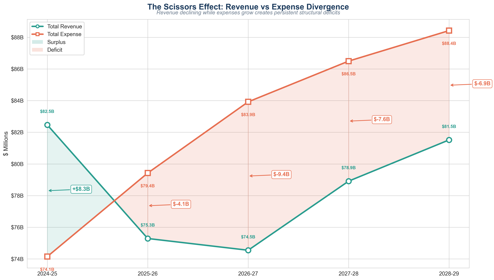

The fiscal consequences are substantial. Taxpayer-supported debt is projected to grow from $85.2 billion to $137.5 billion by 2028-29, an increase of 61 percent. Debt servicing costs rise from $3.2 billion to $4.9 billion annually, a 51 percent escalation that will exceed the individual budgets of 21 of 26 government ministries. The province's net financial assets are forecast to decline from $24.5 billion to negative $3.5 billion, marking a fundamental deterioration in Alberta's balance sheet position.

This expanded analysis situates these projections within a broader context: macroeconomic risks including oil price volatility and the energy transition; interprovincial comparisons revealing Alberta's uniquely narrow tax base; a comprehensive assessment of revenue diversification options; and an evaluation of expenditure efficiency relative to other Canadian provinces. The central finding is that Alberta faces a dual structural problem -- above-average spending combined with below-average non-resource revenue capacity -- that cannot be resolved through commodity price recovery alone.

---

## 1. Fiscal Balance Overview

Alberta's fiscal position shifts from an $8.3 billion surplus in 2024-25 to deficits of $4.1 billion to $9.4 billion across the plan period. The deterioration is driven by two simultaneous forces: a commodity-driven revenue contraction and demand-driven expenditure growth.

**Figure 2: Fiscal Balance Waterfall**

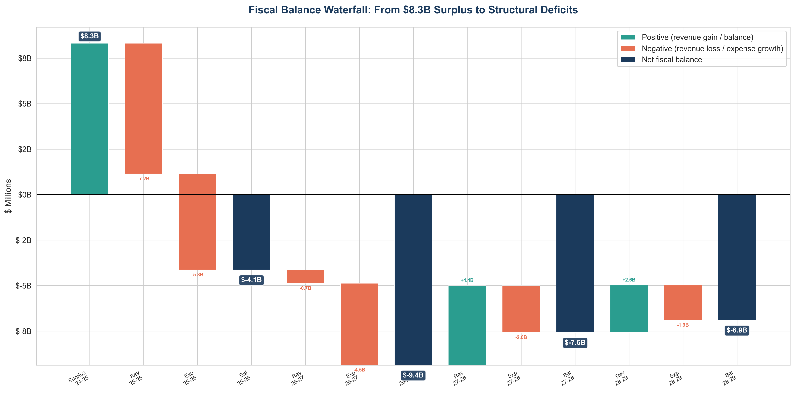

The waterfall above decomposes this transition year by year. The worst projected year is 2026-27, when the deficit peaks at $9.4 billion. Even with partial resource revenue recovery, deficits persist through the entire forecast horizon.

**Table 1: Fiscal Balance Summary**

| Fiscal Year | Total Revenue ($B) | Total Expense ($B) | Surplus/Deficit ($B) | Revenue Change | Expense Change |
|---|---|---|---|---|---|
| 2024-25 | $82.5 | $74.1 | +$8.3 | -- | -- |
| 2025-26 | $75.3 | $79.4 | -$4.1 | -8.7% | +7.1% |
| 2026-27 | $74.6 | $83.9 | -$9.4 | -1.0% | +5.7% |
| 2027-28 | $78.9 | $86.5 | -$7.6 | +5.9% | +3.1% |
| 2028-29 | $81.5 | $88.4 | -$6.9 | +3.3% | +2.2% |

---

# Part II: Revenue Analysis

## 2. Revenue Outlook

### 2.1 Revenue Trajectory

Total revenue declines from $82.5 billion in 2024-25 to $74.6 billion in 2026-27, before partially recovering to $81.5 billion by 2028-29, still $1.0 billion below the starting level. This is not a temporary dip but a structural downward shift.

**Table 2: Revenue Summary by Category**

| Revenue Category | 2024-25 ($B) | 2026-27 ($B) | 2028-29 ($B) | Change (2024-25 to 2026-27) |
|---|---|---|---|---|
| Resource Revenue | $22.0 | $13.2 | $16.9 | -40.0% |
| Tax Revenue | $30.4 | $33.2 | $33.2 | +9.3% |
| Federal Transfers | $12.6 | $13.0 | $13.8 | +8.7% |
| **Total Revenue** | **$82.5** | **$74.6** | **$81.5** | **-9.6%** |

Tax revenue growth of 9.3 percent and stable federal transfers provide a partial offset, but are insufficient to compensate for the resource revenue decline.

**Figure 3: Revenue Composition by Category**

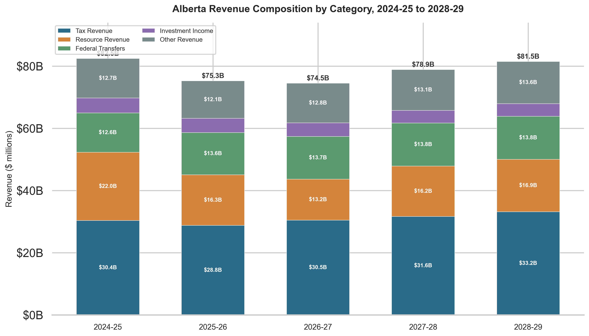

### 2.2 Resource Revenue Risk

Bitumen royalty revenue, the single largest driver of fiscal deterioration, falls from $17.2 billion to $9.7 billion in 2026-27, a $7.5 billion reduction (43.6%). Total resource revenue contracts from $22.0 billion to $13.2 billion at the trough before recovering to $16.9 billion by 2028-29.

**Figure 4: Resource Revenue Decline Trajectory**

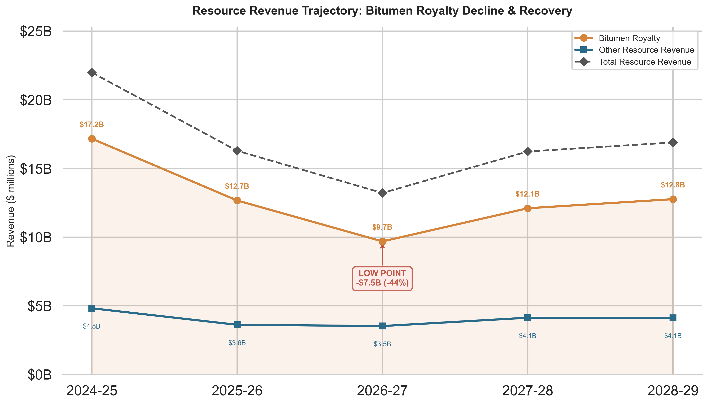

Bitumen royalties alone accounted for 21 percent of total revenue in 2024-25. The magnitude and speed of the projected decline underscores the exposure inherent in Alberta's commodity-dependent revenue model.

### 2.3 Revenue Composition Shift

Resource revenue's share of total revenue drops from 26.7 percent in 2024-25 to 17.7 percent in 2026-27, shifting the revenue base toward tax revenue and federal transfers, which are more predictable but more constrained in growth potential.

**Figure 5: Revenue Composition, 2024-25 vs. 2026-27**

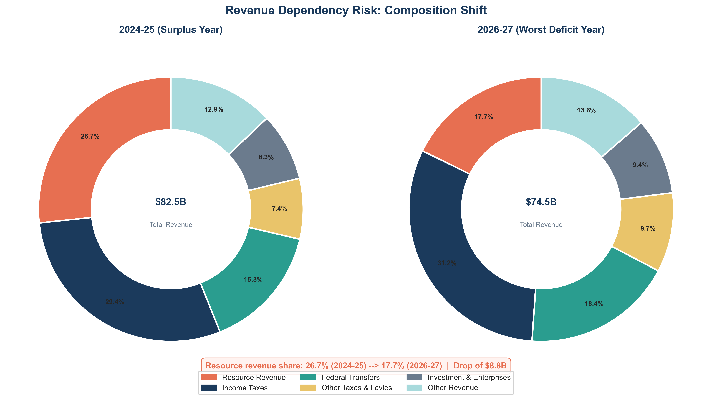

This shift occurs not because alternative revenue sources have been developed, but because the commodity stream itself has contracted. The revenue base has narrowed, not diversified.

---

# Part III: Expense Analysis

## 3. Expense Analysis

### 3.1 Where the Money Goes

Total operating expenditure rises from $62.0 billion to $74.1 billion by 2028-29 (+20%). Growth is concentrated in four ministries, each exceeding $12 billion annually by the end of the plan period.

**Table 3: Largest Ministries by 2026-27 Estimated Spending**

| Rank | Ministry | Approximate Spending ($B) |
|---|---|---|
| 1 | Hospital and Surgical Services | >$13B |
| 2 | Education and Childcare | >$13B |
| 3 | Primary and Preventative Health | >$12B |
| 4 | Assisted Living and Home Care | >$12B |

**Figure 6: Ministry Spending Rankings**

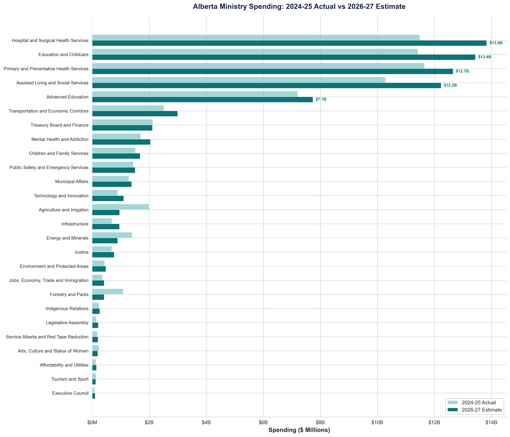

For every dollar of revenue collected, approximately 38.3 cents goes to health care, 28.4 cents to education, and 18.7 cents to social services. Total expenditure equals 113 cents per revenue dollar, a 13-cent structural deficit.

**Figure 7: Where Each Revenue Dollar Goes**

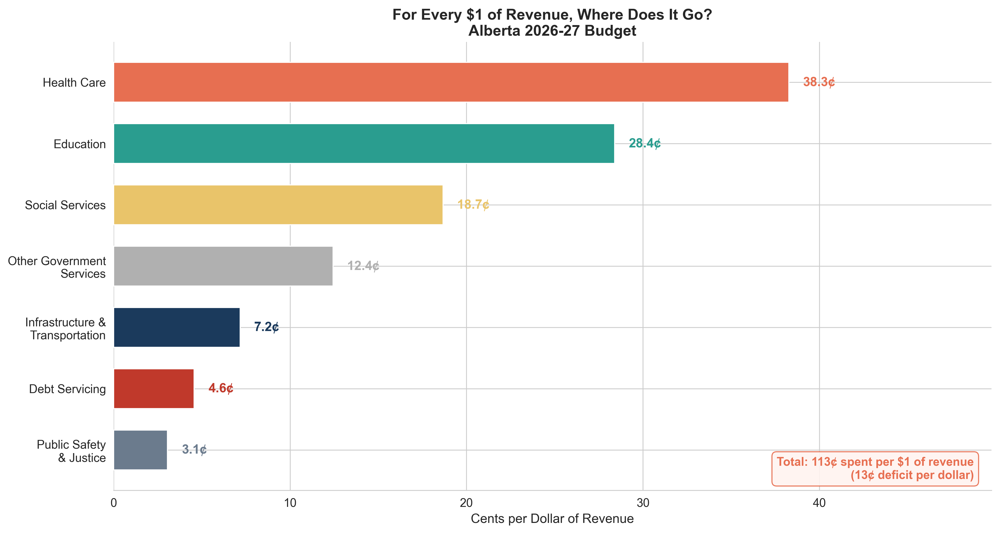

### 3.2 Biggest Spending Changes

The three largest spending increases are:

- **Hospital and Surgical Services:** +$2.3 billion (+20.4%), reflecting demand pressures in acute care, surgical wait-list reduction initiatives, and health workforce cost escalation.
- **Education and Childcare:** +$2.0 billion (+17.7%), driven by enrollment growth, the expansion of early childhood programs, and negotiated compensation increases.
- **Assisted Living and Home Care:** +$1.95 billion (+19.0%), attributable to demographic pressures from an aging population and expanded community-based care models.

The two largest spending decreases are:

- **Agriculture and Irrigation:** -$1.0 billion (-51.6%), reflecting the wind-down of emergency drought and livestock assistance programs.
- **Forestry and Parks:** -$668 million (-61.3%), attributable to the conclusion of extraordinary wildfire suppression expenditures.

These decreases reflect the natural expiry of time-limited disaster response spending, not policy-driven restraint.

**Figure 8: Biggest Spending Increases and Decreases**

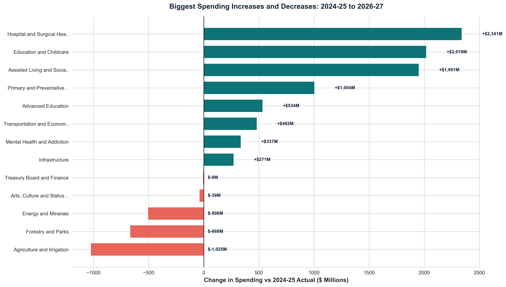

### 3.3 Spending by Policy Area

Health, education, and social services together account for approximately 60 percent of all program spending, a share projected to increase as demand-driven cost pressures outpace other categories.

**Figure 9: Expense Composition by Policy Category**

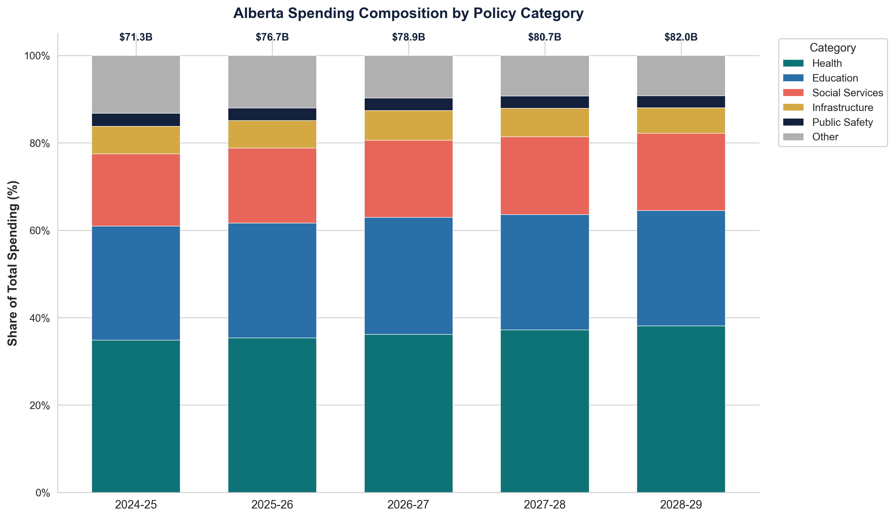

The largest ministries are also among those experiencing the fastest growth, a compounding dynamic that accelerates aggregate spending.

**Figure 10: Expense Growth Rate vs. Budget Size**

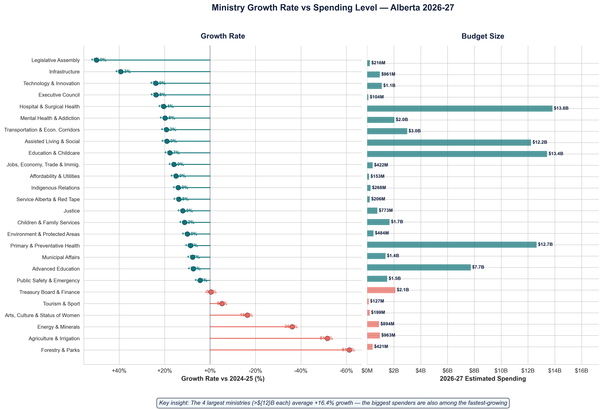

### 3.4 Health Spending Deep Dive

Three health ministries (Hospital and Surgical, Primary and Preventative, and Mental Health and Addiction) collectively form the largest spending block, rising from 34.8 percent to 38.1 percent of total program expense, progressively crowding out other priorities.

**Figure 11: Health Spending Over Time**

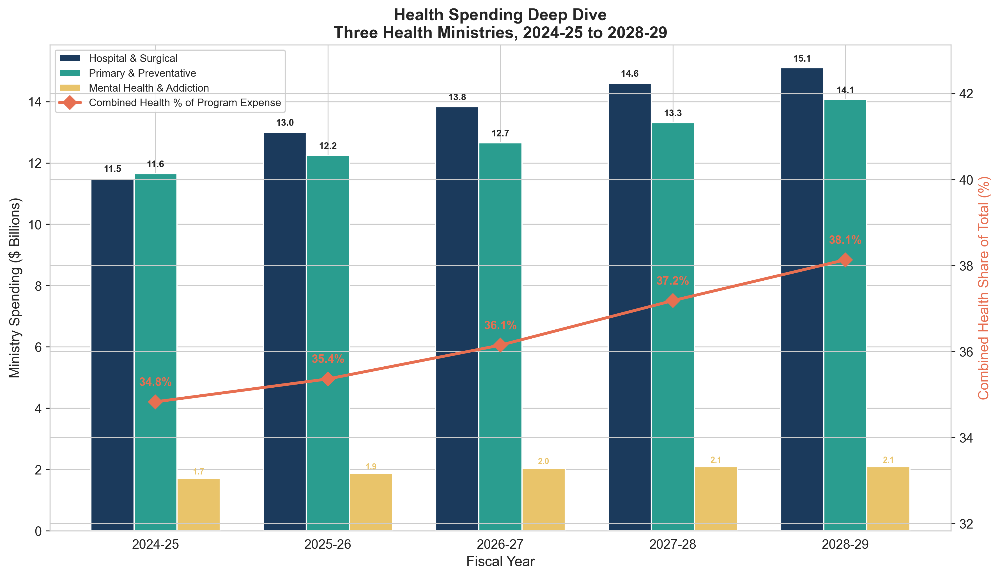

This trajectory reflects structural factors, including population growth, aging demographics, workforce compensation, and pharmaceutical costs, that are unlikely to abate without deliberate policy intervention.

---

# Part IV: Fiscal Gap and Debt

## 4. Revenue vs. Expense Gap

Revenue declines 9.6 percent to a 2026-27 trough while expenditure grows 20 percent over the plan period. These opposing trajectories produce a persistent deficit peaking at $9.4 billion.

**Figure 12: Revenue vs. Expense Gap with Annual Deficit**

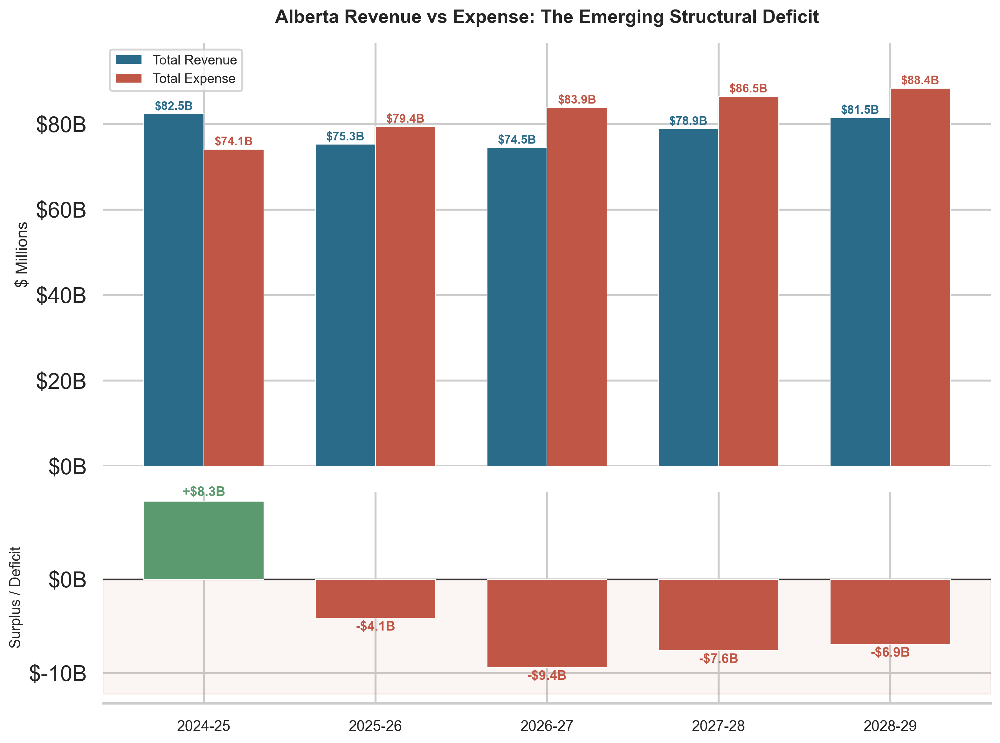

Revenue declines are driven by external commodity markets beyond government control; expenditure increases are driven by domestic service demand and policy commitments. This asymmetry limits the ability to close the gap through revenue-side measures alone.

---

## 5. Debt and Fiscal Sustainability

### 5.1 Cumulative Deficit and Borrowing

Cumulative deficits total approximately $28.0 billion over the plan period, but total new borrowing reaches $50.6 billion. The difference reflects capital expenditures and debt refinancing needs beyond the operating deficit.

**Figure 13: Cumulative Deficit and New Borrowing Requirements**

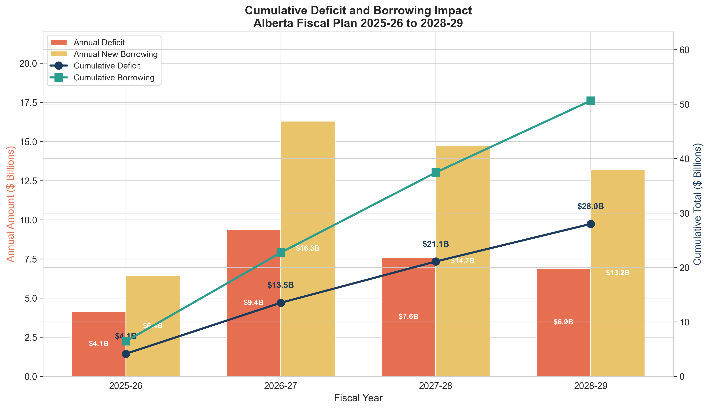

### 5.2 Debt Trajectory

Taxpayer-supported debt grows from $85.2 billion to $137.5 billion by 2028-29 (+61%). Net financial assets decline from $24.5 billion to negative $3.5 billion, meaning liabilities will exceed financial assets for the first time.

**Figure 14: Taxpayer-Supported Debt Growth**

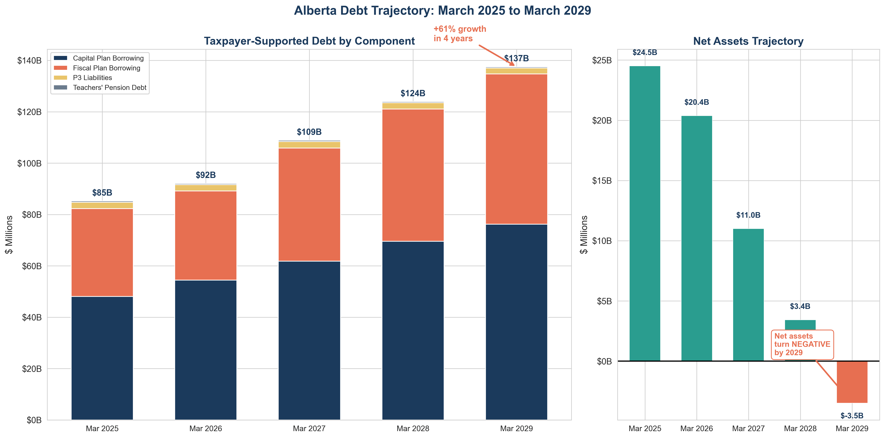

### 5.3 Debt Servicing Cost Escalation

Debt servicing charges rise from $3.2 billion to $4.9 billion (+51%), exceeding the budgets of 21 of 26 ministries by 2028-29.

**Figure 15: Debt Servicing Cost Escalation**

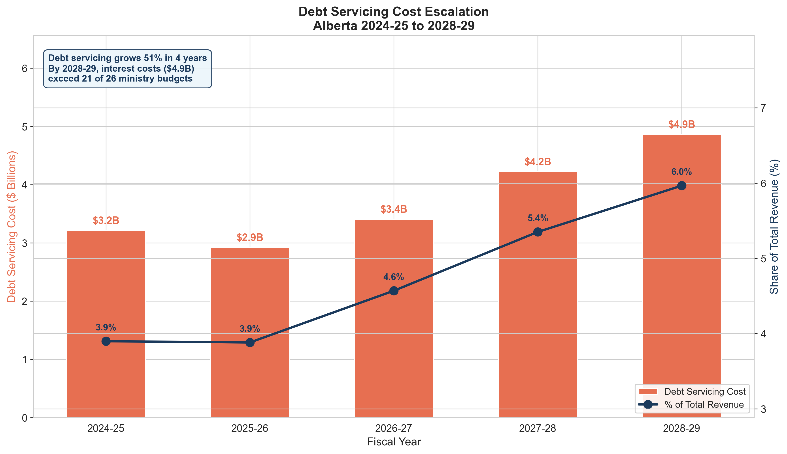

This creates a compounding fiscal constraint: deficits increase debt, which increases servicing costs, which widen future deficits. Breaking this cycle requires sustained revenue improvement, material expenditure restraint, or both.

---

# Part V: Macroeconomic Context

## 6. Macroeconomic Environment

The Fiscal Plan's projections are embedded within a macroeconomic environment characterized by significant uncertainty across multiple dimensions. This section assesses the key external factors that will determine whether the government's fiscal projections prove optimistic, realistic, or conservative.

### 6.1 Oil Price Outlook and Fiscal Sensitivity

The steep decline in bitumen royalty revenue -- from $17.2 billion to $9.7 billion -- is the single most consequential assumption in the Fiscal Plan. It implies WTI crude oil prices trending toward approximately US$60-65/bbl over the forecast horizon, a figure that sits at the lower end of major forecaster consensus.

**Table 4: Oil Price Forecast Comparison**

| Forecaster | WTI Forecast Range (2026-2029) | Methodology |
|---|---|---|
| U.S. Energy Information Administration (EIA) | US$65-75/bbl | Short-Term Energy Outlook (updated monthly) |
| International Energy Agency (IEA) - STEPS | US$75-80/bbl | Stated Policies Scenario |
| IEA - Announced Pledges | US$60-65/bbl | Accelerated transition scenario |
| OPEC | Implicit floor of US$75-80/bbl | Managed supply approach |
| Canadian Bank Consensus (TD, RBC, CIBC, Scotiabank) | US$65-75/bbl | Quarterly provincial outlooks |

Alberta's fiscal sensitivity to oil prices is among the highest of any subnational government globally. A US$1/bbl change in WTI affects provincial resource revenue by approximately $550-630 million annually. The exchange rate compounds this exposure: a 1-cent movement in the CAD/USD rate affects revenue by approximately $350-400 million. In a scenario where WTI is $5/bbl lower than budgeted and the Canadian dollar is 2 cents stronger, the combined revenue impact would be approximately $3.5-4.0 billion -- enough to push the peak deficit from $9.4 billion toward $13 billion.

The Trans Mountain Expansion (TMX), operational since May 2024, provides a partial structural offset. By providing access to Pacific tidewater markets, TMX has compressed the WCS-WTI differential from a historical average of $15-25/bbl to approximately $10-14/bbl. At roughly 3.5 million barrels per day of Alberta production, each $1/bbl improvement in the differential generates approximately $1.3 billion annually for producers, a portion of which flows to the province through royalties.

### 6.2 Energy Transition Risks

The global energy transition represents a longer-term structural risk to Alberta's fiscal model. The IEA's World Energy Outlook 2024 projects global oil demand peaking before 2030 under all scenarios, driven primarily by electric vehicle adoption displacing approximately 6-8 million barrels per day by 2030. Oil sands production faces asymmetric transition risk due to higher per-barrel carbon intensity (70-110 kg CO2/bbl lifecycle emissions vs. 30-60 for conventional crude) and higher marginal production costs ($40-60/bbl breakeven for new projects).

However, existing oil sands operations have significantly lower sustaining costs ($25-35/bbl WTI breakeven), making them economically viable well into the 2030s. TMX's Pacific access partially hedges Alberta against the North American energy transition, as Asian demand for heavy crude is projected to persist longer than North American demand.

The EU Carbon Border Adjustment Mechanism (CBAM), fully operational from January 2026, does not currently cover crude oil. If future CBAM revisions extend to refined petroleum products, Alberta crude could face a per-barrel surcharge of approximately EUR 6-8 (US$7-9) based on its emissions intensity. The direct near-term impact is limited given that very little Alberta crude currently goes to Europe, but CBAM establishes a precedent that other jurisdictions could follow.

### 6.3 Population and Demographic Pressures

Alberta's population grew at approximately 4.4 percent in 2023, the highest of any Canadian province, driven by record international immigration and strong interprovincial migration. The province's population reached approximately 4.83 million by Q3 2024. While federal immigration reductions announced in late 2024 will moderate growth to approximately 1.5-2.5 percent annually for 2026-2029, even this rate creates substantial fiscal pressure.

Population growth simultaneously benefits and strains the fiscal position. On the revenue side, each working-age migrant contributes to the tax base (approximately $5,000-6,000 in per-capita non-resource provincial revenue). On the expense side, each additional resident creates approximately $12,000-14,000 in per-capita program spending demands. Healthcare and education spending growth -- the largest expense drivers in the Fiscal Plan -- are substantially driven by population pressures. Each 1 percent of population growth adds approximately $600-800 million in annual service delivery costs.

Alberta's younger-than-average population (median age approximately 37.8 years vs. the national 41.7) is fiscally favorable in the near term, as a higher working-age proportion means more taxpayers relative to service users. However, this advantage will diminish as the population ages.

### 6.4 Interest Rate Environment and Debt Cost Sensitivity

The Bank of Canada reduced its overnight rate from 5.00 percent in June 2024 to 3.25 percent by December 2024, with market expectations for further easing toward the estimated neutral rate of approximately 2.50-2.75 percent. Provincial borrowing costs sit at approximately 30-60 basis points above Government of Canada bond yields, implying an all-in borrowing cost of approximately 3.4-4.1 percent for new Alberta debt issuance.

The Fiscal Plan projects debt servicing costs rising from $3.2 billion to $4.9 billion on a debt load growing from $85.2 billion to $137.5 billion. Each 25 basis point increase in the weighted average borrowing rate on $137.5 billion adds approximately $344 million in annual debt servicing costs. There is also refinancing risk: as low-rate bonds issued in 2020-2021 mature and are replaced at current rates, the weighted average cost of debt will rise even without further rate increases.

**Table 5: Macroeconomic Risk Factor Summary**

| Risk Factor | Impact Direction | Estimated Fiscal Magnitude | Probability |
|---|---|---|---|
| WTI $5/bbl below assumption | Revenue negative | -$2.8 to -$3.2B/year | Medium |
| WCS differential widens $3/bbl | Revenue negative | -$1.7 to -$2.0B/year | Low (TMX mitigates) |
| CAD 2 cents stronger than assumed | Revenue negative | -$0.7 to -$0.8B/year | Medium |
| Interest rates 50bps higher | Expense increase | +$0.5 to +$0.7B/year | Medium-Low |
| Healthcare costs 3% above plan | Expense increase | +$0.75B/year, cumulative | High |
| Population growth 1% above plan | Mixed (revenue and expense) | Net -$0.2 to -$0.4B/year | Medium |
| US tariffs on Canadian energy | Revenue negative | -$1.0 to -$3.0B/year | Medium |

---

# Part VI: Comparative Analysis

## 7. Interprovincial Fiscal Comparison

Alberta's fiscal position cannot be fully understood in isolation. Comparison with other Canadian provinces reveals the structural characteristics that distinguish Alberta's fiscal challenge and constrain its policy options.

### 7.1 Revenue Structure Comparison

Alberta is the only Canadian province without a provincial sales tax. This is the single most consequential structural distinction in Canadian provincial finance.

**Table 6: Provincial Consumption Tax Rates**

| Province | Tax Type | Provincial Rate | Combined Rate |
|---|---|---|---|
| **Alberta** | **None** | **0%** | **5% (GST only)** |
| British Columbia | PST | 7% | 12% |
| Saskatchewan | PST | 6% | 11% |
| Manitoba | RST | 7% | 12% |
| Ontario | HST | 8% | 13% |
| Quebec | QST | 9.975% | 14.975% |
| Atlantic Provinces | HST | 10% | 15% |

When resource revenues are excluded, Alberta's own-source revenue per capita is the lowest of any Canadian province, approximately $2,000-4,500 per capita below the interprovincial average. This gap is the structural underpinning of Alberta's fiscal vulnerability: government services are subsidized by resource revenue to a degree unmatched by any other jurisdiction.

**Table 7: Revenue Composition by Province (Approximate Shares)**

| Revenue Source | Alberta | BC | Saskatchewan | Ontario | Quebec |
|---|---|---|---|---|---|
| Personal income tax | ~27% | ~27% | ~20% | ~30% | ~32% |
| Consumption taxes (PST/HST/QST) | **0%** | ~17% | ~13% | ~22% | ~20% |
| Resource revenue | **26.7%** | ~4% | ~12% | <1% | <1% |
| Federal transfers | ~15% | ~17% | ~20% | ~20% | ~25% |

Alberta's revenue model depends more heavily on a single volatile commodity stream than any other Canadian province, while lacking the stable consumption tax base that cushions other provinces against economic downturns.

### 7.2 Per-Capita Spending and Debt Metrics

**Table 8: Interprovincial Per-Capita Comparison (Approximate, 2024-25)**

| Province | Per-Capita Program Spending | Debt-to-GDP | Per-Capita Debt | Debt Servicing (% Revenue) |
|---|---|---|---|---|
| Alberta (current) | ~$13,000 | ~11% | ~$17,800 | 3.9% |
| Alberta (2028-29) | ~$14,500 | ~19% | ~$27,500 | 6.6% |
| British Columbia | ~$13,800 | ~17% | ~$17,500 | ~5% |
| Saskatchewan | ~$15,000 | ~17% | ~$15,000 | ~5% |
| Ontario | ~$12,400 | ~39% | ~$26,700 | ~7.5% |
| Quebec | ~$15,400 | ~38% | ~$25,000 | ~6.5% |

Alberta's per-capita debt, currently among the lowest of large provinces, will approach Ontario levels by 2028-29 under the current Fiscal Plan. The 61 percent rate of increase is unprecedented among Canadian provinces outside of wartime or pandemic contexts.

### 7.3 Credit Ratings and Fiscal Position

**Table 9: Provincial Credit Ratings (as of early 2025)**

| Province | Moody's | S&P | DBRS Morningstar |
|---|---|---|---|
| British Columbia | Aaa | AAA | AA (high) |
| Saskatchewan | Aa1 | AA | AA |
| Alberta | Aa1 | A+ | AA (high) |
| Quebec | Aa2 | AA- | AA (low) |
| Ontario | Aa3 | A+ | AA (low) |

Alberta's ratings are strong but have been subject to negative watch during past periods of resource revenue volatility. The combination of structural deficits, rapid debt accumulation, and commodity dependence is precisely the profile that rating agencies flag for downgrade. Alberta was downgraded by Moody's from Aaa to Aa1 in 2016 and by S&P from AAA to A+ over multiple actions during the 2015-2020 period. The current debt trajectory represents a material negative credit event; historical precedent suggests at least one notch of downgrade within 2-3 years if the structural deficit persists.

### 7.4 Historical Context: Alberta's Fiscal Crises

The current fiscal challenge is best understood in the context of Alberta's recurring boom-bust fiscal cycle. The province has experienced four major fiscal crises in the past four decades, each triggered by commodity price declines. The current episode is distinguished by an unprecedented starting debt position.

**Table 10: Alberta's Fiscal Crises Compared**

| Period | Peak Annual Deficit | Cumulative Deficits | Starting Debt | Ending Debt | Primary Cause | Resolution |
|---|---|---|---|---|---|---|
| Getty era (1985-93) | ~$3.4B | ~$15-20B | ~$0 | ~$8-9B | 1986 oil price crash | None (passed to Klein) |
| Klein cuts (1993-96) | ~$3.4B (inherited) | Balanced in 2 years | ~$8-9B | $0 (by 2005) | Inherited deficit | 20% spending cuts |
| NDP period (2015-19) | ~$10.8B | ~$30-35B | ~$0 | ~$30-35B | 2014-15 oil collapse | Not resolved; government changed |
| COVID (2020-21) | ~$16.9B | ~$25-30B | ~$35-40B | ~$75-80B | Pandemic + oil collapse | Commodity price recovery |
| **2026-29 Plan** | **$9.4B** | **~$28B** | **$85.2B** | **$137.5B** | **Structural resource decline** | **No resolution in plan** |

The pattern is clear: Alberta conducts spending reviews during downturns, implements partial restraint, then relaxes fiscal discipline when resource revenues recover. The Klein government achieved the most dramatic fiscal turnaround through 20 percent spending cuts, but those cuts occurred from a starting debt of $8-9 billion. Achieving equivalent cuts from the current $85 billion debt position would require reducing spending by approximately $13-15 billion -- a politically and practically extraordinary proposition. The NDP-era deficits are the closest parallel in scale, but the critical difference is the starting position: the NDP period began from approximately zero net debt, while the current plan begins from $85.2 billion.

---

# Part VII: Revenue Diversification Options

## 8. Revenue Diversification Analysis

Alberta's structural deficit of $9.4 billion is fundamentally a revenue structure problem. The province's non-resource tax revenue per capita is the lowest in Canada, and the resource revenue that fills the gap is declining. This section evaluates the principal options for revenue diversification, with estimated fiscal impacts and feasibility assessments.

### 8.1 The Provincial Sales Tax Question

Alberta's projected 2026-27 deficit of $9.4 billion falls squarely within the estimated revenue range of a 7-8 percent PST. This is the single most important structural finding of this analysis.

Based on Alberta's estimated taxable consumption base of $110-130 billion (household consumption adjusted for standard exemptions including basic groceries, prescription drugs, and residential rent):

**Table 11: Estimated Revenue from a Hypothetical Alberta PST**

| PST Rate | Revenue Estimate (Low-High) | Comparison |
|---|---|---|
| 3% | $3.3 - $3.9B | Below any Canadian province |
| 5% (minimum comparator) | $5.5 - $6.5B | Lowest provincial rate in Canada |
| 6% (Saskatchewan equivalent) | $6.6 - $7.8B | Covers 70-83% of peak deficit |
| 7% (BC/Manitoba equivalent) | $7.7 - $9.1B | Near-complete deficit closure |
| 8% (Ontario HST equivalent) | $8.8 - $10.4B | Full deficit closure |

A PST is regressive, but this can be substantially mitigated through a refundable tax credit for low-income households. Based on federal GST credit design principles, a provincial PST credit program would cost approximately $500-800 million for a 5 percent PST, yielding net revenue of approximately $5.0-5.7 billion. The province would retain the lowest provincial consumption tax rate in Canada while closing the majority of its structural deficit.

Multiple policy research organizations have produced consistent PST revenue estimates, including the University of Calgary School of Public Policy ($5-6 billion at 5 percent), the Parkland Institute ($5-8 billion depending on rate), and the Canadian Centre for Policy Alternatives ($5-7 billion). The Fraser Institute's Tax Freedom Day calculations implicitly confirm the revenue potential, estimating Alberta's per-family tax advantage at $5,000-7,000 annually relative to the Canadian average, of which approximately 40-50 percent is attributable to the absence of a PST.

### 8.2 Corporate and Personal Income Tax Reform

**Corporate Income Tax:** Alberta's 8 percent general CIT rate is 4 full percentage points below the next-lowest province (Ontario at 11.5%) and 4 points below its own pre-2019 rate of 12 percent. The UCP government reduced the rate from 12 to 8 percent as the "Job Creation Tax Cut" in 2019-2020. Independent analyses, including from the Conference Board of Canada, have found limited attributable employment effects, and CIT revenue is actually declining (-10.2%) over the forecast period despite economic growth. Each percentage point increase generates approximately $0.8-1.0 billion annually.

**Table 12: Corporate Income Tax Reform Options**

| Reform | New Rate | Estimated Revenue | Alberta's National Rank |
|---|---|---|---|
| +2pp | 10% | +$1.6 - $2.0B | Still lowest in Canada |
| +3pp | 11% | +$2.4 - $3.0B | Tied 2nd lowest (with ON/QC) |
| +4pp (restore to 12%) | 12% | +$3.2 - $4.0B | Tied with BC/SK/MB |

**Personal Income Tax:** Alberta's 10 percent flat rate on the first $148,269 is the lowest base rate in Canada. Even with the graduated upper brackets introduced in 2015, Alberta's effective PIT rate remains the lowest at all income levels. Raising the base rate by 1 percentage point would generate approximately $1.5-1.8 billion, while more targeted upper-bracket increases would generate $300-600 million.

### 8.3 Other Revenue Instruments

**Table 13: Additional Revenue Options**

| Instrument | Mechanism | Revenue Estimate | Feasibility |
|---|---|---|---|
| Payroll tax (1%) | Ontario-style employer health tax with $1M exemption | $1.7 - $1.9B | Medium |
| Carbon pricing (provincial system) | Replace federal backstop; retain revenue provincially | $2.0 - $3.5B | Low |
| Sin tax package | Comprehensive increases on tobacco, alcohol, cannabis, gambling | $0.75 - $1.5B | Medium-High |
| Tourism levy increase | From 4% to 6-8% | $0.1 - $0.2B | High |
| Resource royalty reform | Windfall tax modeled on UK Energy Profits Levy | $0.5 - $3.0B (volatile) | Low |
| Crown corporation dividends | ATB Financial dividend + AGLC efficiency | $0.15 - $0.4B | High |
| Digital services tax | Provincial DST on qualifying digital revenue | $0.15 - $0.3B | Medium |
| Vehicle registration increase | +$50-100 per vehicle | $0.1 - $0.2B | Medium |

A payroll tax warrants particular attention. Ontario, Quebec, and Manitoba all levy payroll taxes generating stable revenue streams. Alberta's total employment income base of approximately $170-190 billion could support a 1 percent payroll tax yielding $1.7-1.9 billion annually. Payroll taxes are among the most stable revenue sources available and could be earmarked for healthcare funding, directly linking revenue to the province's largest expenditure category.

### 8.4 Heritage Savings Trust Fund Reform

The Alberta Heritage Savings Trust Fund, established in 1976, is one of the world's earliest sovereign wealth funds. Its current value of approximately $23 billion represents a profound underperformance relative to its potential. The fund received contributions for only 11 years (1976-1987) before deposits were suspended, and investment income has been transferred to general revenue annually, preventing compound growth.

**Table 14: Heritage Fund vs. International Sovereign Wealth Funds**

| Fund | Jurisdiction | Current Value | Per Capita | Contribution Rule |
|---|---|---|---|---|
| Norway GPFG | Norway | ~$2.3T CAD | ~$420,000 | All petroleum revenue deposited |
| Alaska Permanent Fund | Alaska | ~$110B CAD | ~$150,000 | 25% of mineral revenue (constitutional) |
| **Alberta Heritage Fund** | **Alberta** | **~$23B CAD** | **~$4,800** | **None since 1987** |
| Texas Rainy Day Fund | Texas | ~$37B CAD | ~$1,300 | Excess severance tax revenue |

Multiple academic analyses estimate that had Alberta continued contributing 15-30 percent of resource revenue and reinvesting returns, the Heritage Fund would hold approximately $150-250 billion today. The opportunity cost of the savings failure -- the difference between actual and potential fund value -- is $125-225 billion.

Key reform proposals include:

1. **Resume contributions**: Dedicate 25-50 percent of resource revenue to the fund. Counter-cyclical rule: contribute a higher share during high-price years.
2. **Norwegian-style fiscal rule**: Limit government spending from the fund to 3-4 percent of fund value, preserving real value through compound growth.
3. **Constitutional protection**: Entrench contribution and withdrawal rules to prevent future governments from raiding the fund (Alaska model).
4. **Independent governance**: Separate fund management from the provincial government into an arm's-length statutory corporation.

The fundamental trade-off: Heritage Fund reform requires accepting larger near-term deficits (or raising other revenue) in exchange for long-term fiscal sustainability. This trade-off is politically difficult during a fiscal crisis but arguably more urgent precisely because of it.

### 8.5 International Lessons: Norway, Alaska, Texas, Western Australia

Four resource-dependent jurisdictions offer instructive parallels:

**Norway** demonstrates that high resource taxation (78 percent marginal rate on petroleum profits) is compatible with continued investment when the framework is stable and predictable. The Government Pension Fund Global, at $2.3 trillion, proves that systematic saving and compound growth can transform a resource-dependent jurisdiction's fiscal position permanently. The fiscal rule limiting spending to 3 percent of fund value decouples government operations from commodity price volatility.

**Alaska** shows that constitutional savings discipline works (the Permanent Fund's 25 percent constitutional deposit rule has accumulated $110 billion), but also that savings alone do not solve the fiscal problem. Alaska has no state income tax and no state sales tax, faces chronic deficits, and has found the no-tax model creates a political trap: the longer a jurisdiction goes without broad taxation, the harder it becomes to introduce. Alberta is in a directly analogous position.

**Texas** is the jurisdiction most frequently cited as Alberta's American analogue. Critically, even Texas levies a 6.25 percent state sales tax that generates approximately US$40 billion annually. Texas demonstrates that economic diversification is the most effective long-term solution, but also that it takes decades and depends on factors (massive population, multiple major metros, geographic advantages) that Alberta cannot easily replicate.

**Western Australia** is the closest structural parallel: a resource-dependent subnational jurisdiction with volatile royalty revenue. WA levies multiple tax instruments Alberta does not -- payroll tax (5.5 percent), stamp duty (up to 5.15 percent), and land tax -- providing revenue diversification that cushions commodity downturns.

The common lesson: every comparable jurisdiction either maintains broader taxation than Alberta or has built massive sovereign wealth reserves, or both. Alberta's combination of no consumption tax, no payroll tax, and a depleted savings fund is unique among resource-dependent jurisdictions globally.

### 8.6 Illustrative Revenue Packages

**Table 15: Revenue Package Scenarios**

| Package | Components | Net Revenue | Deficit Coverage |
|---|---|---|---|
| **A: Minimum Change** | Sin taxes + tourism levy + Crown dividends + registration fees | ~$1.6B | 17% of peak deficit |
| **B: Moderate Reform** | 5% PST (with credit) + CIT to 10% + sin taxes + tourism + Crown dividends | ~$8.8B | 94% of peak deficit |
| **C: Comprehensive Reform** | 7% PST (with credit) + CIT to 11% + payroll tax + PIT reform + sin taxes + Heritage Fund contributions | ~$11.9B (net of Fund deposits) | Full deficit closure + savings |
| **D: Revenue-Neutral Rebalancing** | 3% PST + PIT cut to 9.5% + CIT to 10% + Heritage Fund counter-cyclical rule | ~$3.5B (net) | Partial; stabilizes revenue base |

Package B achieves near-fiscal-balance while maintaining Alberta's position as the lowest-tax major province in Canada. Package C eliminates the deficit entirely, funds Heritage Fund contributions, and begins building long-term fiscal sustainability. Even Package D, the most politically cautious option, would meaningfully stabilize the revenue base by shifting from volatile resource dependence toward a broader consumption tax foundation.

---

# Part VIII: Expenditure Efficiency

## 9. Expenditure Efficiency and Fiscal Frameworks

Revenue diversification addresses one side of the structural equation. This section examines whether Alberta's expenditure levels reflect efficient service delivery or contain opportunities for restraint.

### 9.1 Healthcare Spending Efficiency

Alberta's healthcare system produces average Canadian outcomes at above-average cost. According to CIHI's National Health Expenditure Trends, Alberta's per-capita government health spending of approximately $6,200 exceeds Ontario's by roughly 15 percent and Quebec's by 22 percent. After age-standardization -- adjusting for Alberta's younger-than-average population, which should theoretically require less healthcare spending -- the excess is approximately 5-8 percent above expected levels.

This premium does not purchase superior outcomes. Alberta's surgical wait times are at the national median (27-30 weeks from GP referral to treatment). Life expectancy (approximately 81.3 years pre-COVID) is slightly below the national average. Hospital readmission rates and avoidable mortality measures are similarly mid-pack.

The 2024 restructuring of Alberta Health Services into four sector-specific agencies (Primary Care Alberta, Acute Care Alberta, Continuing Care Alberta, and Recovery Alberta) adds near-term transition costs without demonstrated efficiency gains. International evidence, particularly the UK's 2012 NHS restructuring, consistently shows that health system reorganizations are net-costly in the short to medium term. This is the third major structural reorganization in 30 years (after the Klein-era consolidation of 200 boards into 17, and the 2008 merger into a single AHS), and each previous restructuring imposed significant transition costs.

Potential efficiency gains exist through pharmacare ($200-400 million annually via bulk purchasing), digital health optimization ($100-300 million through reduced duplicate testing and sustained virtual care utilization), and low-value care reduction ($300-500 million through implementation of Choosing Wisely Canada guidelines). However, these gains require upfront investment and 3-5 year implementation horizons.

### 9.2 Public Sector Compensation

Total public sector compensation accounts for approximately 55-60 percent of Alberta government program spending ($35-40 billion annually). Alberta pays a premium of approximately 12-15 percent above national average public sector wages, driven by competition with the resource sector for labour, higher cost of living, and historical collective bargaining patterns.

**Table 16: Public Sector Compensation Premium by Sector**

| Sector | Alberta Level | National Average | Premium |
|---|---|---|---|
| Average weekly earnings (public sector) | ~$1,350 | ~$1,200 | +12.5% |
| Average physician clinical payment | ~$420,000 | ~$360,000 | +16.7% |
| RN annual compensation (incl. benefits) | ~$110,000 | ~$97,500 | +12.8% |
| Teacher salary (10 yr, 6-yr degree) | ~$105,000 | ~$97,000 | +8.2% |

On a $35-40 billion compensation base, the 12-15 percent premium implies approximately $4-6 billion in above-average spending relative to national norms. However, this premium is partially justified by Alberta's higher private sector wages, cost of living, and tight labour market. The 2019-2022 public sector wage freeze demonstrated the risks of aggressive restraint: the resulting nursing shortage required retention bonuses and accelerated hiring that partially offset initial savings, and catch-up settlements of 3-4.25 percent annually subsequently reversed much of the fiscal benefit.

Realistic savings from sustained moderate restraint (limiting growth to CPI), physician compensation reform, and workforce optimization total approximately $1.0-2.0 billion annually over 3-5 years, with significant labour relations and service quality trade-offs.

### 9.3 Past Expenditure Reviews and Their Outcomes

**The MacKinnon Panel (2019)** quantified Alberta's spending gap at $10.4 billion above a four-province comparator average (BC, Ontario, Quebec, Saskatchewan), with higher public sector compensation ($2.0 billion), health spending ($1.5 billion), and education spending ($1.2 billion) as the largest components. The Panel recommended bringing per-capita spending in line with comparators within 3-4 years, implementing a spending growth cap indexed to population plus inflation, establishing an independent fiscal council, and reforming the Heritage Fund.

**Implementation was selective.** The government implemented a public sector wage freeze (estimated $1.0-2.0 billion in cumulative savings), consolidated some agencies and boards ($100-200 million cumulative), and achieved general spending restraint during 2019-2022. However, no legislated spending cap was introduced. No independent fiscal council was established. No Heritage Fund reform occurred. When resource revenues surged in 2022-23, spending growth immediately resumed at 6-9 percent annually, fully unwinding the restraint.

The **Ernst & Young operational review** (2019-2020) identified potential savings of $140-250 million annually from agency consolidation and shared services -- meaningful but modest relative to the total budget.

The recurring pattern is clear: Alberta conducts expenditure reviews during downturns, implements partial restraint, then relaxes fiscal discipline when commodity revenues recover. This "ratchet effect" -- spending rises during booms but proves politically impossible to sustain cuts during recoveries -- is the central challenge for expenditure-side fiscal adjustment.

### 9.4 Fiscal Rules and Institutional Gaps

Alberta lacks the institutional infrastructure for sustained fiscal discipline. The Fiscal Planning and Transparency Act contains no balanced budget requirement, no spending cap, and no enforcement mechanism. Alberta is one of the few major Canadian jurisdictions without independent fiscal oversight comparable to Ontario's Financial Accountability Officer or the federal Parliamentary Budget Officer.

**Table 17: Fiscal Framework Comparison**

| Feature | Alberta | Ontario | Quebec | Norway | Chile |
|---|---|---|---|---|---|
| Balanced budget law | No (plan to return only) | Yes (with exceptions) | Yes (over cycle) | Yes (via spending rule) | Yes (structural balance) |
| Spending cap | No | No | No | 3% of fund value | Structural balance rule |
| Independent fiscal council | No | Yes (FAO) | No | Parliamentary oversight | Expert panels |
| Resource revenue savings rule | No (suspended since 1987) | N/A | Yes (Generations Fund) | All revenue to fund | ESSF mechanism |
| Penalty for non-compliance | None | None (waivable) | None | Political consensus | Legal framework |

International best practices suggest Alberta should adopt: (1) a structural balance rule distinguishing resource from non-resource revenue; (2) mandatory Heritage Fund contributions with a counter-cyclical formula; (3) an independent fiscal council to provide non-partisan analysis; and (4) a spending growth cap indexed to population plus inflation. These institutional reforms would not resolve the immediate deficit but would break the boom-bust spending cycle that has characterized Alberta fiscal policy for four decades.

---

# Part IX: Conclusions

## 10. Key Findings and Policy Implications

This analysis identifies the following findings and their policy implications:

**Structural Findings**

1. **The deficit is structural, not cyclical.** The $9.4 billion peak deficit reflects a fundamental misalignment between Alberta's revenue capacity and expenditure commitments. Even with partial revenue recovery, deficits persist through the entire plan period and cumulate to $28 billion.

2. **Alberta faces a dual structural problem.** Per-capita spending is approximately 10 percent above the four-province comparator average, while non-resource tax revenue per capita is the lowest of any Canadian province. Closing the gap requires action on both sides of the ledger.

3. **Resource revenue dependence remains the central fiscal vulnerability.** Bitumen royalty revenue's 43.6 percent decline is the single largest revenue shock, and resource revenue's share of total revenue (falling from 26.7 to 17.7 percent) underscores the fragility of a commodity-dependent fiscal model in an era of energy transition.

4. **The absence of a provincial sales tax is the defining structural characteristic of Alberta's fiscal position.** A 7 percent PST would generate $7.7-9.1 billion annually, nearly eliminating the entire structural deficit. Every other Canadian province and every comparable international jurisdiction maintains broader taxation than Alberta.

5. **The Heritage Fund represents one of the largest fiscal policy opportunity costs in Canadian history.** At $23 billion against a counterfactual of $150-250 billion, the fund's underperformance reflects four decades of failed savings discipline.

**Risk Assessment**

6. **Macroeconomic risks are asymmetrically weighted to the downside.** Oil price sensitivity ($550-630 million per US$1/bbl), exchange rate exposure ($350-400 million per cent), interest rate sensitivity ($344 million per 25bps on projected debt), and healthcare cost pressures (historically 4-6 percent annual growth vs. general inflation of 2-3 percent) all create potential for outcomes worse than projected.

7. **The debt trajectory poses credit rating risk.** The 61 percent growth in taxpayer-supported debt, from the highest starting position in provincial history, matches the profile that rating agencies have historically flagged for negative action. Further downgrades would increase borrowing costs, exacerbating the debt servicing burden.

8. **Energy transition risks are real but not imminent.** Existing oil sands operations remain economically viable at current prices, and TMX provides structural pricing improvement. However, the long-term demand trajectory for heavy crude is uncertain, and carbon border mechanisms are expanding.

**Expenditure Assessment**

9. **Healthcare spending efficiency is below interprovincial benchmarks.** Alberta pays above-average costs for average outcomes, with a per-capita spending premium of 5-8 percent after age adjustment. The 2024 health system restructuring adds transition costs without demonstrated near-term savings.

10. **Expenditure restraint alone cannot close the fiscal gap without unacceptable service reductions.** Bringing per-capita spending to the national average would close approximately $5-7 billion of the deficit, but would require real cuts to healthcare, education, and social services during a period of rapid population growth.

**Revenue Options**

11. **A moderate revenue diversification package can close the deficit while preserving Alberta's competitive tax advantage.** A 5 percent PST with a refundable low-income credit, combined with a CIT increase to 10 percent and targeted sin tax increases, would generate approximately $8.8 billion annually. Alberta would retain the lowest personal income tax rate, the lowest corporate tax rate, and the lowest consumption tax rate of any Canadian province.

12. **Institutional reform is the prerequisite for sustained fiscal discipline.** An independent fiscal council, legislated spending caps, mandatory Heritage Fund contributions, and a structural balance rule would create the framework to prevent the boom-bust cycle from recurring. Without institutional constraints, any fiscal adjustment will be reversed when commodity revenues next recover.

---

## 11. Methodology and Sources

### Data Sources

This analysis is based on data published in the Government of Alberta's Fiscal Plan 2026-2029, tabled on February 26, 2026. Revenue, expenditure, debt, and fiscal balance figures were extracted from the official budget documents and supplementary fiscal tables. All dollar amounts are expressed in Canadian dollars unless otherwise noted.

### Analytical Methodology

Data processing and visualization were performed using Python 3 (pandas, seaborn, matplotlib). Figures in Parts I-IV reflect the government's own projections; this analysis does not apply independent economic or commodity price forecasts. Year-over-year changes reference the 2024-25 actual unless otherwise specified.

### Comparative and Research Sources

Interprovincial comparisons draw on provincial budget documents, Statistics Canada data, and CIHI health expenditure reports. Revenue diversification estimates use Alberta's economic base data cross-referenced against actual collection rates in comparable provinces. The following sources were consulted:

| Category | Source |
|---|---|
| **Health spending** | CIHI National Health Expenditure Trends; Fraser Institute *Waiting Your Turn*; Statistics Canada life expectancy tables |
| **Provincial fiscal data** | Provincial budget documents (AB, BC, SK, ON, QC); RBC Economics Provincial Fiscal Tables |
| **Oil price forecasts** | U.S. EIA Short-Term Energy Outlook; IEA World Energy Outlook 2024; OPEC World Oil Outlook |
| **PST revenue estimates** | U of Calgary School of Public Policy; Parkland Institute; CCPA Alberta Alternative Budget |
| **Fiscal frameworks** | IMF Fiscal Rules Dataset; C.D. Howe Institute; IFSD (University of Ottawa) |
| **Heritage Fund comparisons** | Norges Bank Investment Management; Alaska Permanent Fund Corporation; Texas Comptroller |
| **Expenditure reviews** | MacKinnon Panel Report (2019); Ernst & Young ABC Review; Auditor General of Alberta |
| **Demographics** | Statistics Canada Table 17-10-0009-01 |
| **Interest rates** | Bank of Canada key interest rates; Government of Canada bond yields |

### Limitations

Interprovincial and international comparison figures are approximate, drawn from the most recent available data (primarily 2024-25 fiscal year). Specific figures should be verified against primary source publications for formal citation. Revenue estimates for hypothetical tax instruments are indicative ranges based on Alberta's economic base and comparable jurisdiction collection rates; actual revenue would depend on specific policy design, behavioral responses, and economic conditions at the time of implementation.

---

## List of Figures

| Figure | Title | File |
|---|---|---|
| 1 | Revenue vs. Expense Divergence (The Scissors Effect) | `plots/scissors_effect.png` |
| 2 | Fiscal Balance Waterfall | `plots/fiscal_balance_waterfall.png` |
| 3 | Revenue Composition by Category | `plots/revenue_composition.png` |
| 4 | Resource Revenue Decline Trajectory | `plots/revenue_resource_risk.png` |
| 5 | Revenue Composition, 2024-25 vs. 2026-27 | `plots/revenue_dependency_comparison.png` |
| 6 | Ministry Spending Rankings | `plots/expense_ministry_ranking.png` |
| 7 | Where Each Revenue Dollar Goes | `plots/per_dollar_breakdown.png` |
| 8 | Biggest Spending Increases and Decreases | `plots/expense_changes_tornado.png` |
| 9 | Expense Composition by Policy Category | `plots/expense_composition_categories.png` |
| 10 | Expense Growth Rate vs. Budget Size | `plots/expense_growth_vs_size.png` |
| 11 | Health Spending Over Time | `plots/health_spending_deep_dive.png` |
| 12 | Revenue vs. Expense Gap with Annual Deficit | `plots/revenue_vs_expense_gap.png` |
| 13 | Cumulative Deficit and New Borrowing Requirements | `plots/cumulative_deficit.png` |
| 14 | Taxpayer-Supported Debt Growth | `plots/debt_trajectory.png` |
| 15 | Debt Servicing Cost Escalation | `plots/debt_servicing_escalation.png` |

---

*Source: Government of Alberta, Fiscal Plan 2026-29 (February 26, 2026)*
*Analysis prepared using Python, pandas, seaborn, and matplotlib*
*Comparative research draws on CIHI, Statistics Canada, provincial budget documents, and policy research institutions*
