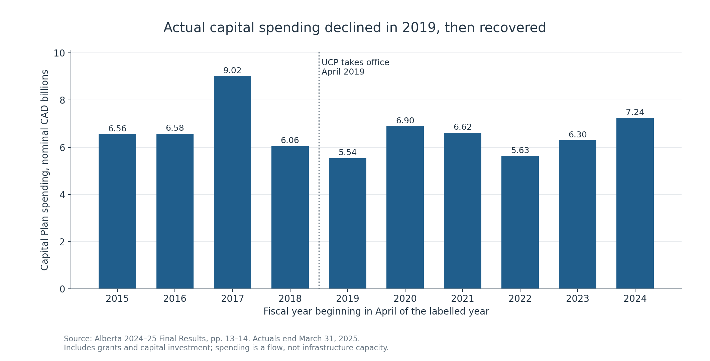
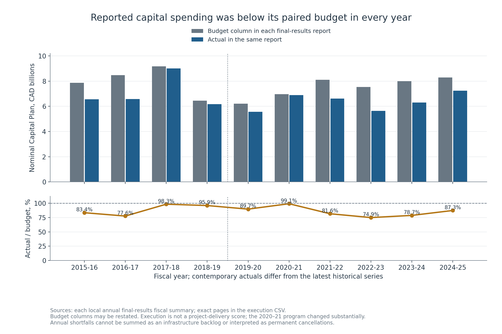
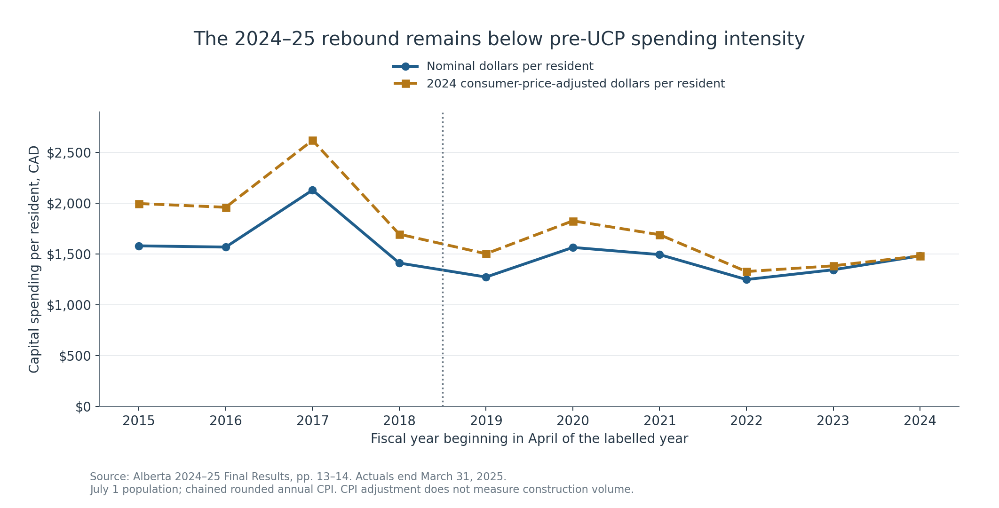
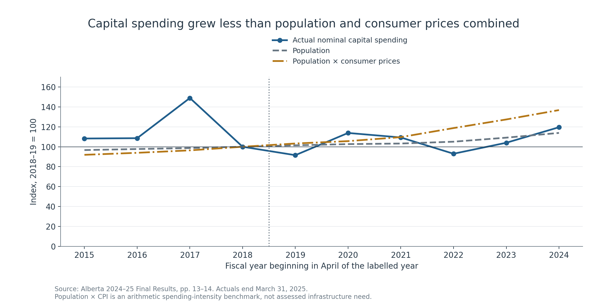
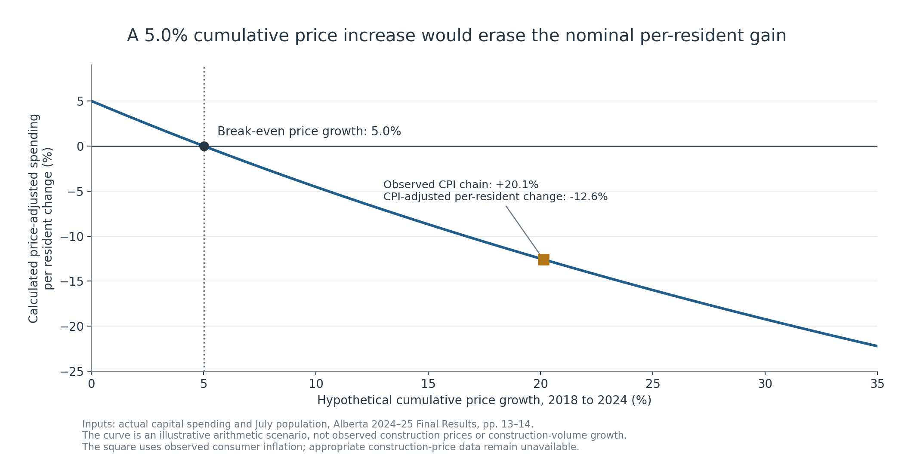
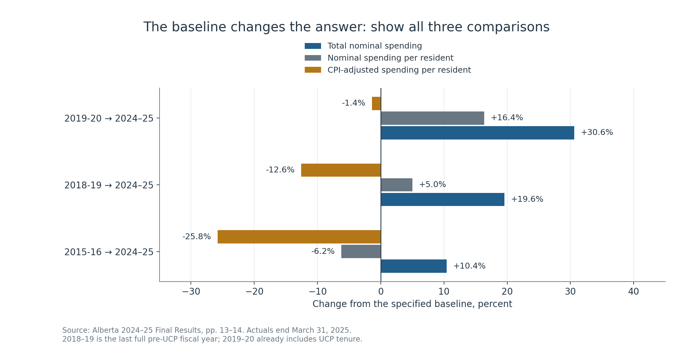
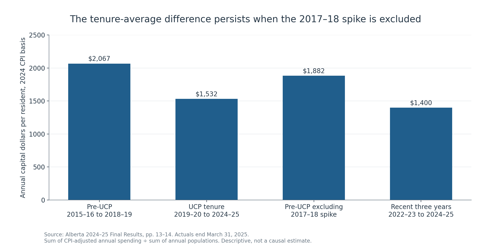
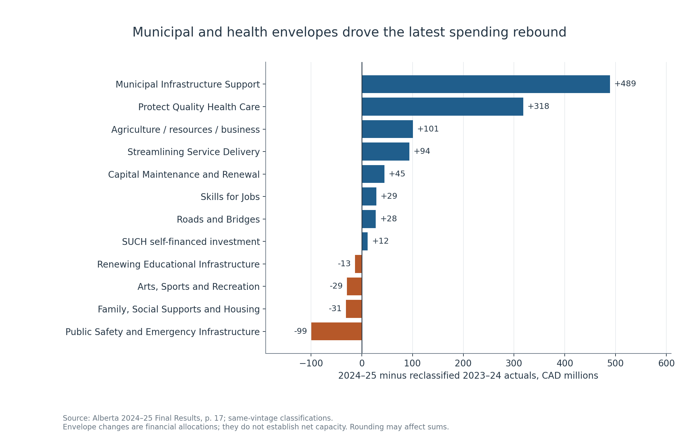
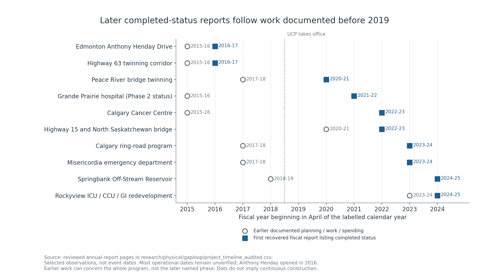

# Alberta delivered infrastructure after 2019, while CPI-adjusted capital spending per resident fell from 2018–19 to 2024–25

**Analysis date:** October 9, 2026. **Financial actuals and year-end observations through:** March 31, 2025. **Primary source published:** June 2025.

## Executive summary

- **Identifiable infrastructure was delivered under UCP tenure.** The sources document hospital and cancer-centre construction, school projects, highway and bridge expansions, and flood protection. They also show many projects began before April 2019. Completion during a government is not proof that government initiated the project.
- **The latest rebound is substantial but does not erase the earlier reduction in spending intensity.** Actual capital spending rose from $6.06 billion in 2018–19 to $7.24 billion in 2024–25: **19.6%**. Over the same period population rose **13.9%** and consumer prices rose approximately **20.1%**. Capital spending per resident rose 5.0% in nominal dollars but fell **12.6% on a CPI-adjusted basis**.
- **Baseline choice matters.** Compared with the first UCP fiscal year, 2019–20, CPI-adjusted capital spending per resident was 1.4% lower in 2024–25, approximately flat given unresolved fiscal alignment and price-measure uncertainty; compared with 2015–16, it was 25.8% lower. The latest year improved 7.1% from 2023–24. These describe spending, not net service capacity or a causal political effect.
- **Population-adjusted physical capacity remains unquantified.** Project records prove selected construction and modernization, but do not provide consistent net school seats, staffed hospital beds, network kilometres, water-treatment capacity, or asset-condition series. The evidence cannot establish whether provincial infrastructure provision kept pace with population.

## 1. What period and political transition does this report cover?

The question is interpreted as the **United Conservative Party's return to government in April 2019**, with 2018–19 the last full pre-UCP fiscal year and 2019–20 the transition year. Alberta also had Progressive Conservative governments before May 2015, so “the start of conservative rule” is not interpreted as the historical beginning of conservative government. Fiscal 2015–16 includes the PC-to-NDP transition; 2019–20 includes roughly one month before the UCP took office. Annual figures are not split by administration.

As of October 2026, the ten most recently completed fiscal years are **2016–17 through 2025–26**. The accessible source corpus instead supports **ten fiscal observations from 2015–16 through 2024–25**. This is an explicitly lagged ten-year window, not a claim to cover the latest completed decade. Fiscal 2025–26 actuals and 2025 population were not available in the local corpus, and official online retrieval was blocked by the environment's network policy. They are omitted rather than invented. Fiscal 2026–27 is ongoing, and multiyear 2026–29 budget projections are not actual infrastructure delivered.

The report studies financial inputs and selected physical outputs across education, health, transport, municipal infrastructure, water, housing, public safety, and maintenance. **It does not establish every project or every change in Alberta infrastructure.** That would require a reconciled provincial/municipal asset and project register, including openings, replacements, closures and operating readiness.

## 2. Capital investment is different from operating expense

The province's **Capital Plan** combines capital investment in provincially consolidated assets with capital grants and other support to entities outside that consolidation, such as municipalities. Some grants appear in expense; acquisition of owned capital assets generally enters the balance sheet and is amortized over time. Consequently, **do not add the entire Capital Plan to total expense**: doing so double-counts grants and mixes accounting concepts. Similarly, the operating expenses of the Ministry of Infrastructure do not measure the province's entire infrastructure investment.

The primary source is the **2024–25 Final Results Year-End Report**, although the repository filename is `2024-2025 Budget.pdf`. Its Historical Fiscal Summary provides one report vintage of capital totals, and its economic table provides population and inflation inputs. Using one vintage avoids a patchwork of original and revised totals. **However, the province explicitly warns that numbers are not strictly comparable because of accounting-policy changes over time.** One vintage improves consistency; it does not eliminate those structural breaks. [Capital definitions and historical comparability: PDF p. 14](../Budget%20PDFs/2024-2025%20Budget.pdf#page=14); [latest composition: pp. 16–17](../Budget%20PDFs/2024-2025%20Budget.pdf#page=16).

In 2024–25 the province reports about **$4.3B capital investment and $2.9B capital grants**, together approximately $7.2B. Grants can fund infrastructure owned by municipalities or partners, so the entire flow will not appear as a matching increase in provincial asset stock. Spending also covers replacement and maintenance, not just expansion.

The exact latest same-vintage figures sharpen that distinction: capital grants rose **$831M** from $2.103B in 2023–24 to $2.934B in 2024–25; capital investment rose **$112M** from $4.197B to $4.309B. Together they reconcile to the **$943M** increase. Grants explain **88.1% of the net nominal increase**, and their share of the total rose from 33.4% to 40.5%. Grants can finance valuable municipal and partner assets; this composition simply prevents treating the whole increase as investment in provincially consolidated assets. Neither component measures net service capacity. [Exact paired summary, PDF p. 3](../Budget%20PDFs/2024-2025%20Budget.pdf#page=3); [composition audit](research/capital/EXECUTION_COMPOSITION_FINDINGS.md).

## 3. The actual spending trajectory



| Fiscal year | Capital spending, CAD B | July population, M | Nominal CAD/resident | 2024 CPI-adjusted CAD/resident |
| --- | --- | --- | --- | --- |
| 2015-16 | 6.558 | 4.150 | $1,580 | $1,997 |
| 2016-17 | 6.578 | 4.195 | $1,568 | $1,960 |
| 2017-18 | 9.021 | 4.237 | $2,129 | $2,619 |
| 2018-19 | 6.057 | 4.293 | $1,411 | $1,695 |
| 2019-20 | 5.545 | 4.355 | $1,273 | $1,502 |
| 2020-21 | 6.896 | 4.407 | $1,565 | $1,826 |
| 2021-22 | 6.622 | 4.432 | $1,494 | $1,690 |
| 2022-23 | 5.633 | 4.511 | $1,249 | $1,327 |
| 2023-24 | 6.300 | 4.685 | $1,345 | $1,384 |
| 2024-25 | 7.243 | 4.889 | $1,481 | $1,481 |

All amounts are actual capital-plan totals from the latest report available in this local corpus. Population is July 1 of the fiscal year's starting calendar year, rounded to the nearest thousand. CPI-adjusted values use annual Alberta consumer-price growth, compounded from rounded rates; they are a purchasing-power sensitivity, not a construction-volume estimate. [Inputs: PDF pp. 13–14](../Budget%20PDFs/2024-2025%20Budget.pdf#page=13).

Three movements matter:

1. **Spending was already declining before the UCP transition.** The 2017–18 peak of $9.02B partly reflected grants accelerated from future years. It is not a neutral baseline for “normal” annual delivery. The following year fell to $6.06B. The 2017–18 source attributes the increase to accelerated municipal transportation, climate-program grants, and progress on other projects; it also records $800M of Municipal Sustainability Initiative grants moved forward. [2017–18 report, PDF pp. 22–23 / printed pp. 20–21](../Budget%20PDFs/2017%20Budget.pdf#page=22).
2. **The first UCP fiscal year fell further.** Actual capital spending declined 8.5% from 2018–19 to 2019–20; CPI-adjusted spending per resident declined 11.4%. Subsequent pandemic-era spending rebounded, before a low in 2022–23. An annual before/after chart cannot separate policy from construction schedules, accounting, weather, federal funding, commodity conditions or COVID-19.
3. **The latest recovery was real on the consumer-price measure.** In 2024–25 nominal spending rose 15.0% and CPI-adjusted spending per resident rose 7.1% over the prior year. Nevertheless, the endpoint remained below the last full pre-UCP year on the adjusted per-resident measure.

### Plans, execution and source revisions



| Fiscal year | Paired budget, CAD M | Contemporary actual, CAD M | Actual / budget | Latest historical actual, CAD M |
| --- | --- | --- | --- | --- |
| 2015-16 | 7,863 | 6,558 | 83.4% | 6,558 |
| 2016-17 | 8,481 | 6,578 | 77.6% | 6,578 |
| 2017-18 | 9,175 | 9,016 | 98.3% | 9,021 |
| 2018-19 | 6,444 | 6,180 | 95.9% | 6,057 |
| 2019-20 | 6,206 | 5,564 | 89.7% | 5,545 |
| 2020-21 | 6,960 | 6,896 | 99.1% | 6,896 |
| 2021-22 | 8,114 | 6,622 | 81.6% | 6,622 |
| 2022-23 | 7,534 | 5,644 | 74.9% | 5,633 |
| 2023-24 | 8,005 | 6,300 | 78.7% | 6,300 |
| 2024-25 | 8,299 | 7,243 | 87.3% | 7,243 |

Each row pairs the **budget column and contemporary actual in that year's final-results report**, retaining their common presentation. This is a different question from the latest-vintage actual trajectory above. Budget columns can themselves reflect restatements and are not a reconstruction of original appropriation authority or the final in-year forecast. In this local corpus reported actual capital spending was below its paired budget in all ten years. The 2022–23 ratio was 74.9%, compared with 87.3% in 2024–25. These ratios measure financial execution, not delivery of the planned project list, procurement efficiency, or a government's causal performance.

The 2020–21 ratio of 99.1% is particularly instructive: the source says its Capital Plan was **revised substantially**, with **$1.1B added for COVID-19/recovery support**, while other cash flows and self-financed investment moved down. A near-budget aggregate total therefore masks a changed program. Annual shortfalls must not be summed as a maintenance backlog or unmet infrastructure need; postponed spending may recur in later budgets and actuals. [2020–21 changes, PDF pp. 16 and 18](../Budget%20PDFs/2020-21%20Budget.pdf#page=16); [execution data and exact source pages](research/capital/budget_execution_original_vintage.csv).

The new [adjacent-vintage ledger](research/capital/adjacent_vintage_revision_ledger.csv) records important financial revisions separately. The 2018–19 contemporary total was $6.180B, revised to $6.057B; the entire $123M change is in the reported investment component. The 2022–23 total changed from $5.644B to $5.633B, a $11M grant revision. **The accessible narratives do not isolate the exact causes of these two revisions.** They are not assigned invented policy explanations, nor is the $123M attributed to the separate ministry-construction attribution transfer. The $19M 2019–20 accounting reclassification is documented in section 6. The primary longitudinal series retains the latest local historical vintage; execution ratios retain contemporary paired columns.

## 4. Population growth explains why more dollars can mean lower spending intensity



From 2018–19 to 2024–25 population rose from **4.293M to 4.889M**, an increase of approximately **596k residents**. Nominal spending per resident moved from **$1,411 to $1,481**. Expressed on a 2024 consumer-price basis, the earlier year's spending was **$1,695 per resident**, versus $1,481 in 2024–25.



Population and inflation must be combined multiplicatively. Over the pre-UCP-to-latest comparison, population × CPI rose **36.8%**, compared with 19.6% growth in nominal capital spending. A spending series exceeding population alone and inflation alone can still fail to exceed their combined effect.

Holding **2018–19 CPI-adjusted capital spending per resident** constant would imply an arithmetic 2024–25 spending benchmark of **$8.29 billion**; the $7.24 billion actually spent was **$1.04 billion below that benchmark**. This is **not** an estimate of infrastructure need, deferred maintenance, an unfunded commitment, or a recommended budget. Neither the CPI benchmark nor the starting-year allocation establishes adequate infrastructure provision.

The CPI adjustment is not a construction deflator. Hospitals, roads and schools face different labour, material and procurement costs, and their composition changes. A defensible estimate of construction volume needs sector-specific price indices and consistent project scope. Population is also a broad denominator: students are more relevant for school adequacy, age/health needs for hospitals, traffic for roads, and local service areas for water. Spending per resident measures allocation intensity, not individual service quality.



Because nominal spending per resident rose about 5.0% from 2018–19 to 2024–25, **5.0% cumulative price growth is the arithmetic break-even threshold** for an unchanged price-adjusted allocation per resident. Under a hypothetical 10% price increase the adjusted change would be about −4.5%; under 20%, about −12.5%. These scenarios are **not observed construction inflation**. They show why a construction-price series is needed, without substituting assumed prices for missing observations. The observed consumer-price chain rose 20.1%, which produces this report's −12.6% CPI-adjusted result. [Independent sensitivity validation](research/demography/sensitivity_validation.md).

## 5. Show baseline and tenure sensitivity rather than selecting one political story



| Baseline → 2024–25 | Total nominal spending | Population | Consumer prices | Nominal per resident | CPI-adjusted per resident |
| --- | --- | --- | --- | --- | --- |
| 2015-16 → 2024–25 | +10.4% | +17.8% | +26.4% | -6.2% | -25.8% |
| 2018-19 → 2024–25 | +19.6% | +13.9% | +20.1% | +5.0% | -12.6% |
| 2019-20 → 2024–25 | +30.6% | +12.3% | +18.0% | +16.4% | -1.4% |

2018–19 is the main political-transition baseline because it precedes the UCP government. Starting at 2019–20 changes the conclusion because capital spending had already fallen. Starting at 2015–16 answers the longer-window question but includes the 2015 government transition and different accounting and project conditions.



The population-weighted annual CPI-adjusted spending measure is **$2,067 per resident** for 2015–16 through 2018–19 and **$1,532** for 2019–20 through 2024–25, a descriptive difference of **-25.9%**. Excluding the entire unusually high 2017–18 observation reduces the pre-UCP figure to **$1,882**, with the UCP-tenure figure still **18.6%** lower. Excluding one year is a coarse robustness check, not a correction for the timing of all accelerated grants.

The two periods contain four and six years; use annual intensity or annual averages, not raw totals to rank governments. This small provincial time series provides no untreated comparison group. Project lags, inherited contracts, accounting shifts and external shocks prevent a credible causal estimate of the government's independent effect. No statistical-significance or causality claim is made. A policy evaluation would need harmonized project-level starts, contracts, revised cash flows, completions, construction costs, operational capacity and a defensible comparison design.

## 6. Where did the latest increase go?

### The first UCP year changed allocations unevenly

The 2019–20 report's own current/prior pair provides a financial view of the transition. These are **ministry capital rows in that report's presentation**, not a stable decade-long functional-sector panel:

| Ministry capital row | 2018–19 revised actual, CAD M | 2019–20 contemporaneous actual, CAD M | Difference, CAD M |
|---|---:|---:|---:|
| Education | 678 | 600 | −78 |
| Health | 925 | 1,083 | +158 |
| Infrastructure | 269 | 125 | −144 |
| Transportation | 1,757 | 1,551 | −206 |
| Municipal Affairs | 889 | 1,124 | +235 |
| Advanced Education | 694 | 554 | −140 |

This shows that the aggregate first-year decline did **not** mean every infrastructure-related allocation fell: health and municipal rows increased while education, transport and others declined. The pair's reported total is $6.057B to $5.564B, whereas the primary latest-vintage series uses $5.545B for 2019–20. The following report explains **$19M reclassified from capital grants into operating expense**, without changing total expense or taxpayer debt. Do not interpret that revision as a spending cut. Ministry attribution also shifted construction among Infrastructure, Education and Health around 2018–19, preventing a naive ministry-level decade chart. [2019–20 source pair, PDF p. 15](../Budget%20PDFs/2019-20%20Budget.pdf#page=15); [2020–21 reclassification note, PDF p. 2](../Budget%20PDFs/2020-21%20Budget.pdf#page=2); [earlier attribution warning, PDF pp. 2 and 9](../Budget%20PDFs/2018-19%20Budget.pdf#page=2).

The contemporaneous report describes transportation, school and other funds reprofiled to later years because of slower project progress. A later pandemic/recovery-year comparison shows a pronounced municipal/transport rebound. Neither comparison establishes physical capacity changes or permanent cancellations. [Paired-table audit and retained data](research/capital/early_ucp_comparisons.md).

### The latest rebound was concentrated in municipal and health envelopes

The latest report restates 2023–24 into the 2024–25 classification, allowing a more defensible sector comparison than splicing ministry labels over the entire decade.



| Capital envelope | 2023–24 actual, CAD M | 2024–25 actual, CAD M | Change, CAD M |
| --- | --- | --- | --- |
| Municipal Infrastructure Support | 1,580 | 2,069 | +489 |
| Protect Quality Health Care | 376 | 694 | +318 |
| Agriculture, Natural Resources, and Business Development | 217 | 318 | +101 |
| Streamlining Service Delivery | 305 | 399 | +94 |
| Capital Maintenance and Renewal | 1,302 | 1,347 | +45 |
| Skills for Jobs | 83 | 112 | +29 |
| Roads and Bridges | 514 | 542 | +28 |
| SUCH self-financed investment | 732 | 744 | +12 |
| Renewing Educational Infrastructure | 602 | 589 | -13 |
| Arts, Sports and Recreation | 151 | 122 | -29 |
| Family, Social Supports and Housing | 103 | 72 | -31 |
| Public Safety and Emergency Infrastructure | 334 | 235 | -99 |

Municipal support rose **$489M** and the health envelope rose **$318M**. Together they explain approximately **85.6% of the $943M net increase**, an arithmetic allocation decomposition, not evidence of beds or route kilometres delivered. Some sectors fell: the education envelope was down $13M, housing/social support down $31M, and public safety down $99M. Education and health maintenance is also in the separate maintenance envelope; therefore these envelopes are not all-in sector investment totals. [Same-vintage actual table, PDF p. 17](../Budget%20PDFs/2024-2025%20Budget.pdf#page=17).

The individually rounded component changes sum to $944M, $1M more than the reported $943M consolidated change. Components exclude the core-government subtotal and the fully consolidated total; adding those rows to component values would double-count. The report's source pie also labels $744M of self-financed spending as 12%; $744M divided by $7.243B is approximately 10.3%, so that graphic's percentage is not repeated here.

The 2024–25 Capital Plan spent **$7.243B against $8.299B budgeted**, an undershoot of **$1.056B, or 12.7%**. Health was $505M below budget, municipal infrastructure $287M below, and education $133M below. The report attributes major differences to project progress, planning, scope and cash-flow schedules. **Underspending against that year's budget does not by itself prove cancellation or permanent reduction.** These are actual-versus-budget differences, whereas the chart is actual-versus-prior-actual growth.

Capital Maintenance and Renewal spending was **$1.347B**, approximately **18.6% of total actual capital spending**. Its purpose includes preserving bridges, highways, health facilities, schools, post-secondary and other public assets. Maintenance spending can prevent deterioration but does not quantify whether backlog or condition improved. Avoid treating the Roads and Bridges expansion envelope as all transportation work: the maintenance envelope separately includes $673M of bridge/highway rehabilitation. [PDF pp. 16–17](../Budget%20PDFs/2024-2025%20Budget.pdf#page=16).

## 7. What physical infrastructure actually changed?

The following evidence concerns selected documented projects and outputs. A source's “completed” label must be interpreted using its definition: recent reports define completion as construction ended, potentially before operational opening; earlier reports used operational completion. A project in an “as of March 31” completed-status list also need not have first completed that year. For example, Quest appears in the 2021–22 completed list although the 2016–17 report already described its first full year of injections. Total capital-plan project funding is a multiyear commitment and must not be read as spending during the listed status year. [Completion-year audit and exact source references](research/physical/gaploop/completion_year_audit.md).



The figure pairs an earlier documented stage with the first recovered fiscal report listing a selected project as completed. Both dots are **source observations**, not automatically actual initiation or completion dates; their interval is not an estimate of continuous construction or construction duration. Phase 1 of Grande Prairie hospital is separately listed completed in 2020–21; the plotted hospital status concerns Phase 2. Exact source pages and stage wording are in the [audited 17-project ledger](research/physical/gaploop/project_timeline_audited.csv). Four records support explicitly dated construction-completion fiscal years; the other thirteen supply status observations. Operational calendar year 2016 is source-verified for Anthony Henday; other operational years remain missing. These examples establish cross-administration pipelines without assigning exclusive political credit.

For phased programs, the earlier observation can concern the broader program: early Grande Prairie work does not date initiation of Phase 2, and earlier Calgary ring-road spending includes the southwest stage rather than proving initiation of the final western segment. The chart preserves those broader project scopes.

### Schools: new buildings and modernization, with net seats unresolved

Named 2024–25 completions include **Elder Dr. Francis Whiskeyjack School and Father Michael McCaffery Catholic High School in Edmonton, Ohpaho Secondary in Leduc, Harry Balfour in Grande Prairie, Prairie Winds Secondary in Coaldale, and Iron Ridge Secondary in Blackfalds**. The report lists 12 school projects completed and **11,000+ new and modernized spaces**, alongside 87 projects in progress supporting 60,000+ new and modernized spaces. The in-progress pipeline is not delivered capacity. [PDF pp. 20, 23](../Budget%20PDFs/2024-2025%20Budget.pdf#page=20).

A significant **policy and pipeline change** was the School Construction Accelerator Program launched in fall 2024. Its stated anticipated output is 200k new and modernized spaces through up to 90 new schools, modernization or replacement of up to 24 existing schools, modular classrooms and public charter-school expansion. These are **announced future outputs**, not additional delivered seats at March 2025. The reported active school-project pipeline rose from 57 in 2023–24 to 87 in 2024–25, but project counts do not measure remaining capacity or construction progress. [Program announcement in final-results source, PDF p. 15](../Budget%20PDFs/2024-2025%20Budget.pdf#page=15); [prior pipeline, 2023–24 PDF p. 20](../Budget%20PDFs/tbf-goa-2023-2024%20Budget.pdf#page=20).

For 2021–22 the report separately identifies **5,000+ new student spaces and 5,900+ modernized spaces**. The latest combined total cannot be treated as all new seats or compared directly with the earlier new-seat figure. Annual lists also include replacements and occasional planning/design-only projects. Summing six years' reported school-project counts would produce 96 entries, **not 96 newly opened schools**. [2021–22 report, PDF pp. 20, 23](../Budget%20PDFs/2021-22%20Budget.pdf#page=20).

The pre-2019 reports also document substantial school construction. Their cited capital-plan pipeline measures are cumulative completions from an expanding cohort approved since 2011: for example, 2018–19 reports 207 completed of 278 approved projects. Other passages do report period outputs: the 2017–18 MeasuringUp overview says approximately **21,600 new student spaces** were created and **15,000 spaces modernized or replaced**, in the context of September 2017 school openings. This is a concrete predecessor-period output observation, but not a standardized net-seat series comparable to later mixed metrics. Neither changing project cohorts nor these differently scoped gross outputs support a political productivity ratio. Net capacity per student requires openings, predecessor school capacities, retired seats, student enrolment and local distribution. A provincial population ratio alone cannot establish classroom adequacy. [2018–19 report, PDF p. 10](../Budget%20PDFs/2018-19%20Budget.pdf#page=10); [2017–18 overview, physical PDF p. 93](../Budget%20PDFs/2017%20Budget.pdf#page=93).

### Health: major facility deliveries, with construction distinguished from service

| Documented delivery | Evidence and stage | What cannot be inferred |
|---|---|---|
| Grande Prairie Regional Hospital | Phase 1 listed completed in 2020–21; Phase 2 in 2021–22. Full-service acute hospital and cancer clinic, $850M combined capital-plan funding. Earlier reports already show construction. | Net additional provincial staffed beds or exclusive UCP initiation. |
| Calgary Cancer Centre | The 2022–23 report lists construction complete and anticipates public opening in 2024. $1.4B total capital-plan funding. | An exact actual completion/opening year, patient service at the reporting cutoff, or all gross capacity as net additional capacity. |
| Misericordia emergency department | Listed completed in the 2023–24 report; designed for approximately 60k visits/year. | An independently dated completion, actual throughput, waiting-time improvement or net hospital beds. |
| High Prairie renal dialysis | 2021–22 completed-project source says six dialysis stations introduced at the High Prairie Health Complex. | Province-wide net station growth, removal of other facilities, or delivered treatment volumes. |
| Rockyview ICU/CCU/GI redevelopment | The 2024–25 report lists construction complete; more single-patient units and improved space. | An independently dated completion or a numeric net-bed increase; neither is supplied in the cited passage. |
| Chinook Regional Hospital surgical work | The 2024–25 report lists construction complete for expansion of two operating rooms and more inpatient rooms. | An independently dated completion, two net-new operating rooms, or a quantified net-bed addition. |
| Recovery communities | Three existing/open communities in Red Deer, Lethbridge and Gunn with **200 treatment beds** by March 2025; eight more with 500+ beds remain in progress. | Adding Gunn's 100 beds again to the 200 total; mixing addiction beds with acute hospital beds. |

Sources: [2020–21 PDF p. 23](../Budget%20PDFs/2020-21%20Budget.pdf#page=23), [2021–22 PDF p. 23](../Budget%20PDFs/2021-22%20Budget.pdf#page=23), [2022–23 PDF p. 23](../Budget%20PDFs/2022-2023%20Budget.pdf#page=23), [2023–24 PDF p. 23](../Budget%20PDFs/tbf-goa-2023-2024%20Budget.pdf#page=23), [2024–25 named projects, PDF p. 23](../Budget%20PDFs/2024-2025%20Budget.pdf#page=23), [recovery communities, PDF pp. 15 and 20](../Budget%20PDFs/2024-2025%20Budget.pdf#page=20). The [health evidence ledger](research/physical/health/health_project_evidence.csv) contains reviewed summaries and caveats; [source excerpts](research/physical/health/source_excerpts.txt) retain the original passages.

There is a material internal inconsistency: **2024–25 p. 15 prose places 17 health facility projects in a completion-highlight list, while p. 20 says two completed and 17 in progress; p. 23 names the two completions.** This report uses the granular table and named project records and flags the discrepancy rather than repeating the larger number. Consistent staffed-bed inventories, predecessor capacity and operational dates remain needed for provincial beds-per-resident growth.

Two additional gross care-space observations are recoverable: the 2018–19 source reports ten completed Affordable Supportive Living Initiative projects adding **1,177 long-term-care spaces**; the 2022–23 source reports completion of **871 new continuing-care spaces**. Long-term care and the broader continuing-care scope are not interchangeable, and neither passage reconciles closures or staffing. These values are shown separately, not used as a comparable provincial bed series. [2018–19 PDF p. 10](../Budget%20PDFs/2018-19%20Budget.pdf#page=10); [2022–23 PDF p. 15](../Budget%20PDFs/2022-2023%20Budget.pdf#page=15); [health source/definition audit](research/physical/gaploop/health/new_health_evidence.md).

### Roads and bridges: targeted expansion alongside substantial rehabilitation

The UCP-period sources document **the Highway 43X Grande Prairie bypass, Peace River bridge twinning, Highway 834 Tofield bypass, Highway 15 twinning and the North Saskatchewan River bridge, Calgary ring-road completion, and the Bow River bridge expansion on southeast Stoney Trail**. The latest project widens an existing westbound bridge from three to four lanes and adds an eastbound bridge and pedestrian crossing. These are concrete corridor improvements. Sources: [2019–20 PDF p. 19](../Budget%20PDFs/2019-20%20Budget.pdf#page=19), [2020–21 PDF p. 23](../Budget%20PDFs/2020-21%20Budget.pdf#page=23), [2021–22 PDF p. 23](../Budget%20PDFs/2021-22%20Budget.pdf#page=23), [2022–23 PDF p. 23](../Budget%20PDFs/2022-2023%20Budget.pdf#page=23), [2023–24 PDF p. 23](../Budget%20PDFs/tbf-goa-2023-2024%20Budget.pdf#page=23), [2024–25 PDF p. 23](../Budget%20PDFs/2024-2025%20Budget.pdf#page=23).

The Calgary completion description covers the **101 km whole ring-road corridor**. It does not mean 101 km of road was built in 2023–24. Similarly, a highway's initial construction and later final paving must not be counted as two separate new corridors. Before 2019 the sources already record Anthony Henday Drive and the Highway 63 twinning corridor completing in 2016. Long project histories cross administrations. [2016–17 report, PDF p. 21](../Budget%20PDFs/2016-2017%20Budget.pdf#page=21).

The 2023–24 source also documents construction complete for **3.5 km of Highway 19 twinning**, from Highway 60 eastward, plus intersection and service-road works. This is local route distance, not lane kilometres or a provincial net-network growth figure. Southwest Calgary ring-road's 31 km stage and the later final west/whole-ring status are distinct milestones within one program; the earlier source's whole-ring percentage is not used because it conflicts with the later 101 km corridor description. [Highway 19, PDF p. 23](../Budget%20PDFs/tbf-goa-2023-2024%20Budget.pdf#page=23); [stage and unit audit](research/physical/gaploop/completion_year_audit.md).

For 2024–25 the report records **30+ bridge construction and about 65 road rehabilitation projects**, as well as two road/bridge expansion projects. Counts do not reveal length, lane additions, bridge replacements, or condition improvement. The apparent network stock of about 64k km uses “lane kilometres” in the latest report but “two lanes equivalent length” in 2023–24, so it cannot support an aggregate network-growth rate. Rounded bridge counts of about 4.6k and 4.8k similarly lack a net-addition reconciliation. Highway 3 and 11 twinning remained ongoing at the evidence cutoff. [Latest reported network/works, PDF p. 20](../Budget%20PDFs/2024-2025%20Budget.pdf#page=20), [ongoing corridors, pp. 19 and 22](../Budget%20PDFs/2024-2025%20Budget.pdf#page=22), [2023–24 unit label, PDF p. 20](../Budget%20PDFs/tbf-goa-2023-2024%20Budget.pdf#page=20), [2020–21 bridge stock, PDF p. 20](../Budget%20PDFs/2020-21%20Budget.pdf#page=20).

### Water, flood protection and municipalities: distinguish resilience from service capacity

The **Springbank Off-Stream Reservoir** appears in the 2024–25 completed-project section, described as a dry flood reservoir protecting Calgary and downstream Elbow River communities. This is a concrete flood-resilience asset; it is not drinking-water capacity. The source establishes construction completion, not an independently verified operational certification date or measured damage avoided. [PDF p. 23](../Budget%20PDFs/2024-2025%20Budget.pdf#page=23).

The report records **$236M across 125 rural projects** through a combined basket of strategic transportation, water/wastewater partnership and Water for Life programs. This is neither 125 water projects nor 125 completed projects. Treatment capacity, connections, water quality and asset-condition outcomes are not reported consistently here. [PDF p. 15](../Budget%20PDFs/2024-2025%20Budget.pdf#page=15).

The municipal funding architecture changed from **$487M MSI in 2023–24 to $724M LGFF actually provided in 2024–25**. These imply about **$104 to $148 per resident** using the same-vintage population estimates, a nominal rise of approximately 42.5%. The latest LGFF allocation was 53% to Calgary and Edmonton. This narrow grant-program transition is not the entire municipal funding basket, and financial transfers do not establish assets completed. LRT commitments and projects in progress cannot be labelled completed transit without municipality/transit operating records. [2023–24 PDF p. 16](../Budget%20PDFs/tbf-goa-2023-2024%20Budget.pdf#page=16); [2024–25 PDF p. 15](../Budget%20PDFs/2024-2025%20Budget.pdf#page=15).

### Housing, public safety, post-secondary and digital infrastructure

The latest year-end report documents **388 housing units completed and 617 in progress**, plus selected housing projects in Conklin and elsewhere. Conklin's completed construction comprises five four-bedroom and ten two/three-bedroom units: **15 gross housing units**, not fifteen buildings or net provincial additions. The broad existing affordable-housing stock of 60k+ units does not reconcile new deliveries with removals, eligibility changes or ownership boundaries. Net affordable units per eligible household remain unresolved. Four courthouse projects were in progress; they are not new delivered facilities. The prior source lists the Red Deer Justice Centre completed with **12 courtrooms** and expansion space, without reconciling predecessor courtroom retirements. [2024–25 PDF pp. 20 and 23](../Budget%20PDFs/2024-2025%20Budget.pdf#page=20); [Red Deer, 2023–24 PDF pp. 19 and 23](../Budget%20PDFs/tbf-goa-2023-2024%20Budget.pdf#page=23).

Post-secondary projects, digital systems, broadband, public safety, arts and recreation are present in the spending envelopes and project lists. For example, the latest source identifies $48M for the Alberta Broadband Strategy, while the NAIT skills centre, MacEwan business building and other projects remain in planning/design/construction. Spending is not equivalent to verified connections or usable student capacity. These sectors are included financially; consistent decade-long physical-output inventories were not recovered. [PDF pp. 17, 21–23](../Budget%20PDFs/2024-2025%20Budget.pdf#page=17).

A dated post-secondary example is the **University of Lethbridge Destination Project**, which the 2019–20 report explicitly says completed in **January 2020**, replacing an outdated and overcrowded science building. The 2022–23 report also lists the University of Calgary MacKimmie redevelopment completed. These show selected facility changes; replacing and renewing buildings does not itself quantify net student seats or enrolment-adjusted capacity. [Lethbridge, 2019–20 PDF p. 19](../Budget%20PDFs/2019-20%20Budget.pdf#page=19); [MacKimmie, 2022–23 PDF p. 23](../Budget%20PDFs/2022-2023%20Budget.pdf#page=23).

Some local output descriptions go further: the 2021–22 report records completion of approximately **100 km of Northern Lights Gas Co-op supply pipeline** in Mackenzie County, and the 2020–21 completed-project description reports consolidation of **37 independently managed data centres into three enterprise-class centres**. These establish selected utility and digital changes, but not newly connected households or observed service availability. Fewer data centres can reflect consolidation; counting buildings alone would misread that change. [Pipeline, 2021–22 PDF pp. 15 and 23](../Budget%20PDFs/2021-22%20Budget.pdf#page=15); [digital consolidation, 2020–21 PDF p. 23](../Budget%20PDFs/2020-21%20Budget.pdf#page=23).

## 8. Why asset accounts do not settle the physical-growth question

The March 2025 balance sheet reports **$62.925B capital/other nonfinancial assets**, including approximately $61.7B capital assets. The historical fiscal table shows **$58.845B** under its capital/nonfinancial label. The difference equals **$4.080B spent deferred capital contributions**; the analogous prior-year arithmetic also reconciles. The historical row therefore must not be presented as a clean gross tangible-infrastructure stock measure. [PDF pp. 11–14](../Budget%20PDFs/2024-2025%20Budget.pdf#page=11); [independent accounting check](review/stock_accounting_check.md).

The report describes capital assets increasing about $1.3B, with investment offset by amortization, disposals and accounting adjustments. Book value is neither replacement cost nor physical capacity; municipal grant-funded assets are not automatically inside the provincial balance sheet. A new building can replace an old one, modernization can extend useful life without adding capacity, and an unstaffed room may not deliver services. This accounting evidence supports asset investment, not a complete provincial capacity-growth conclusion.

The shortened source also leaves a flow-to-stock bridge unresolved: its Capital Plan summary reports **$4.309B capital investment**, while its capital-asset narrative describes approximately **$3.9B investment** less $2.6B amortization, disposals and adjustments. It does not reconcile the difference within the accessible file. The narrative is rounded, so no exact $400M gap is asserted; cash timing, donated assets or other possible accounting explanations are not assigned without a supported bridge. These remain distinct reported measures. [Source bridge audit](research/capital/INVESTMENT_TO_ASSET_ROLLFORWARD_GAP.md).

Accounting standards can change that book value without a corresponding building addition or removal. The 2022–23 source says adopting the Asset Retirement Obligations standard increased the restated 2021–22 tangible-capital value by **$692M**; the 2023–24 source says adopting P3 accounting decreased opening tangible-capital net book value by **$415M**, without restating prior comparatives. Neither is treated as a physical infrastructure event. [2022–23 accounting notes, PDF p. 2](../Budget%20PDFs/2022-2023%20Budget.pdf#page=2); [2023–24 accounting notes, PDF p. 2](../Budget%20PDFs/tbf-goa-2023-2024%20Budget.pdf#page=2).

## 9. Evidence completeness and next useful measurements

| Sector | Financial inputs | Selected delivery evidence | Consistent net stock | Capacity adjusted for demand/population | Condition/backlog |
|---|---|---|---|---|---|
| Schools | Yes; maintenance separate | Yes; mixed new/modernized | Not reconciled | Needs net seats and enrolment by location | Not recovered |
| Health | Yes; maintenance and self-finance separate | Yes; construction/opening differ | Not reconciled | Needs staffed acute/continuing-care beds separately, age/demand | Not recovered |
| Roads and bridges | Yes; rehabilitation separate | Yes; named corridors and works | Units/rounding unresolved | Needs consistent lane-km, traffic, access and safety | Not recovered |
| Municipal/transit/water | Yes; transfers and shared programs | Selected; not exhaustive | Not recovered | Needs route/service capacity, connections and local population | Not recovered |
| Housing | Yes; mixed envelope | Selected delivered units | No opening/removal reconciliation | Needs net units, household eligibility/demand | Not recovered |
| Other public assets | Yes; recent envelopes | Selected examples | Not recovered | Sector-specific demand series required | Not recovered |

The evidence supports a conclusion about **spending intensity and selected infrastructure deliveries**. It does not justify claiming that infrastructure shrank, that all capacity expanded, that population needs were met, or that one party caused the measured pattern. The most valuable follow-up is a reconciled net-capacity and condition series, rather than simply collecting more announcements.

Older full annual reports contain service/performance measures that the recent short year-end corpus does not reproduce consistently. For example, continuing-care admission within 30 days fell from 60% in 2015–16 to 52% in 2017–18, but the denominator is **clients admitted during the reporting period**, not everyone waiting. Placement-policy changes, facility preferences, delayed openings and water-damaged facilities constrain interpretation. Older government-building energy-intensity results likewise measure energy use per floor area, not net service capacity or maintenance backlog. These are retained in the [additional-indicator evidence ledger](research/physical/gaploop/additional_indicators.csv), with exact definitions and methodology pages, rather than spliced into an unsupported decade-wide outcome series. Absence from the abbreviated recent reports does not mean the measures ceased to exist elsewhere.

The [local source inventory](research/source_verification/CORPUS_INVENTORY.md) makes this coverage break inspectable: the 2015–16, 2016–17 and 2017–18 full annual-report files contain 128, 151 and 154 physical pages, while the supplied 2018–19 summary has 16 pages and the 2019–20 summary 20; subsequent year-end files have 24 each. A reference to a detailed statement schedule outside a short file is not recovered evidence from that schedule. Similarly named repository files therefore cannot be assumed to supply equivalent performance or financial-note coverage.

Three concrete additions would change the scope of the answer: (1) retrieve 2025–26 actuals and revised population to close the latest-decade gap; (2) harmonize student seats/enrolment, staffed beds, road/bridge units, water/transit capacity, housing removals and facility openings; (3) deflate sector spending using compatible construction-price series and reconcile accounting changes and maintenance backlogs. Online destinations required for those sources are saved in the environment configuration draft; no credentials are requested in chat.

The [evidence-gap register](research/source_verification/EVIDENCE_GAPS.md) specifies the missing source/definition for each extension and the reconciliation required before it can change the conclusion. It distinguishes unavailable observations, unresolved accounting causes, incompatible units, operational-date uncertainty and missing demand denominators.

## 10. Methods, cleaning and validation

### Source hierarchy and cleaning

Official local final-results PDFs control the financial and physical claims. Earlier repository CSVs and notebooks are context, not trusted infrastructure inputs: they study operating expenses and contain unversioned population/CPI assumptions. Two agents independently extracted demographic inputs, and separate financial and physical-research agents retained exact source passages and hashes. A reviewer independently recomputed consequential ratios from the source inputs. The detailed correction log is in [review](review/).

Cleaning retains fiscal-year identifiers, original units, source vintage, page references and actual/budget status. Joins enforce one row per year and one-to-one matching. Missing actuals or physical capacity remain missing, not zero. Financial totals use one vintage; recent sector pairs use the same reclassified report. Earlier ministry reorganizations prevent a naive decade-long sector panel. Incomplete early ministry extraction was quarantined and excluded from all computations. Source PDFs and existing tracked repository files were not rewritten.

### Formulas

```text
Nominal capital dollars = Capital Plan CAD millions × 1,000,000
Nominal spending per resident = nominal capital dollars / July 1 population
CPI index(2015) = 100
CPI index(t) = CPI index(t−1) × (1 + annual Alberta CPI growth(t)/100)
CPI-adjusted spending(t), 2024 basis = nominal spending(t) × CPI(2024)/CPI(t)
Adjusted spending per resident = CPI-adjusted spending / population
Percent change = (endpoint / specified baseline − 1) × 100
Population-weighted annual intensity = sum(adjusted annual spending) / sum(annual populations)
```

The 2015 CPI growth rate is not compounded into a 2015-based index; growth from 2015 to 2024 uses 2016–2024 rates. Fiscal spending is paired with July population and calendar-year annual CPI of the fiscal starting year. This transparent approximation differs from a full fiscal-year average of quarterly population and monthly prices. Source-vintage demographic revisions and fiscal-calendar misalignment are not removed by the arithmetic.

A separate [cross-vintage source audit](research/demography/evidence_gap_review.md) compares seven local final-results reports. All overlapping 2015–2024 annual CPI growth rates agree; July population histories show observed differences of up to 14k for 2018, 16k for 2019 and 32k for 2022. These differences exceed rounding alone. Isolated scenarios replacing only a historical baseline population, while keeping the latest endpoint and other inputs fixed, preserve the direction of the main comparisons. They are explicitly mixed-vintage sensitivity scenarios, not recommended primary series or full revision bounds. Only one local vintage supplies 2024 population, so the absence of an observed endpoint revision does not mean zero uncertainty. Quarterly population and monthly CPI remain needed for fiscal alignment. An independent parser checks all 78 archived source rows, including a corrected negative CPI rate outside the main analysis window.

### Robustness and uncertainty

The report compares 2015–16, 2018–19 and 2019–20 baselines, includes the latest annual recovery, and shows tenure means with and without the 2017–18 spike. Rounding sensitivity assumes annual CPI rates are within ±0.05 percentage points, population within ±500, and capital totals within ±$0.5M. Under these deterministic worst-case bounds the 2018–19-to-2024–25 adjusted per-resident change ranges from **-12.9% to -12.3%**. This is **not a statistical confidence interval** and excludes source revisions, accounting shifts, fiscal alignment and construction-price uncertainty.

No missing observations are imputed. No trend regression, forecast or interrupted-time-series causal model is used: ten annual observations with major confounds cannot identify a government effect credibly. A financial input index is not a validated model of service adequacy.

### Reproduce and inspect

See [README](README.md) for setup and commands, [executed notebook](Alberta_Infrastructure_Analysis.ipynb) for the runnable companion, [analysis data](data/), [source research](research/), and [validation log](review/validation_log.md). The [claim-to-source register](research/source_verification/CLAIM_REGISTER.md) links consequential claims to original PDF pages and exact extracted page text, with interpretation limits. Its anchor checks locate evidence; they do not automatically validate arithmetic or meaning. The main analysis creates all financial tables and plots from source-reviewed CSVs. Tests check source extraction, joins, reconciliation, important endpoint calculations, status scope, CPI chaining and report consistency.

The Data report-app runtime and its required shared contract/preparer are unavailable in this cloud environment, so **a hosted interactive report app was not built or published**. The repository Markdown report, standalone PNG/SVG figures and executed notebook are the delivered artifacts. This limitation is separate from the financial-source and physical-capacity gaps above.
