# Alberta's budget and quality of life: what the evidence supports

**Reviewed 9 October 2026. Financial actuals: 2015–16 through 2024–25. Outcome dates vary and are shown beside each result.**

The evidence supports **a mixed assessment, with identifiable service shortfalls and improvements**, rather than a defensible claim that Alberta's budget has improved quality of life overall. Recent government reports show longer emergency-department waits and weaker mathematics achievement, alongside better access to selected elective surgeries and lower property-crime rates. Inflation-adjusted average weekly earnings were below their 2018 level in 2024. These are descriptive findings; they do not establish that a particular budget or government caused the changes.

The distinction matters because the budget measures resources, while quality of life depends on what residents experience. Total functional program expense rose from **$54.502B in 2018–19 to $71.337B in 2024–25**, but our broad CPI-adjusted per-resident sensitivity fell **4.3%**. This does not measure service volume, efficiency or need. Population growth, prices, accounting changes, age/case mix and changing program responsibilities affect the comparison.

The strongest contribution of this evidence loop is to connect actual spending with **recent, separately sourced outcomes**, including directly downloaded Statistics Canada poverty and life-expectancy series, instead of treating larger budgets, completed projects or job totals as proof of success. Alberta's 2024 poverty rate was 11.0% on the latest 2023-base Market Basket Measure, up from 10.2% in 2023; no statistical-significance claim is made. Period life expectancy recovered to 81.53 years in 2024, still below 81.96 in 2019. Other direct welfare outcomes—housing cost burdens, life satisfaction and healthy life expectancy—remain unverified in this assessment. No synthetic quality-of-life score is calculated.

## A readable assessment of the observed outcomes

|Area and observation period|Verified result|What it establishes|What it does not establish|
|---|---|---|---|
|Emergency care, 2021–22→2024–25|90th-percentile time to first physician assessment at the 16 largest sites rose from 4.5 to 7.0 hours; latest result worse than 6.7 hours in 2023–24|Worsening on this defined access measure; latest target to improve on prior result missed|Average wait, every hospital, treatment quality, mortality or budget causation|
|Selected elective surgeries, 2023–24→2024–25|Within-benchmark hip 62.4→72.8%, knee 53.3→62.5%, cataract 59.7→62.8%|Improved access among completed elective procedures|All waiting patients, all procedures, unique people or elimination of unmet need|
|Diagnostic access, 2021–22→2024–25|MRI within priority targets 68→41%; CT 87→80%|Deterioration over this window; latest CT stable at 80%|Changes in all diagnostic capacity, clinical mix or health outcomes|
|Life expectancy, calendar 2019→2024|Alberta 81.96→81.53 years, after 80.19 in 2022;2023–24 preliminary|Recovery from 2022, still below 2019 in one current source vintage|Healthy-life years, a newborn cohort's forecast lifespan, individual causes or budget attribution|
|Five-year school completion, 2019–20→2023–24|86.2→87.1%, after a peak of 88.6%; latest target 88.8% missed|Small endpoint increase, recent decline and a matched target shortfall|Diploma-only graduation, learning gains or a single administration's effect|
|Grade 9 mathematics, 2021–22→2024–25|53.1→51.7% weighted acceptable-standard result; target 55.3% missed|A reported achievement shortfall on this test definition|Every student's learning trajectory or an unconfounded spending effect|
|Pay and work, calendar 2018→2024|Average weekly earnings +15.7% nominal, −3.7% CPI-adjusted; unemployment 6.5→7.0%|Lower average pay purchasing power on this sensitivity and higher unemployment rate|Median after-tax household income, household-specific affordability or poverty|
|Poverty, calendar 2022→2024,2023-baseMBM|Alberta 10.5→10.2→11.0%; Canada 2024 also 11.0%|Latest estimated incidence above both prior years on the same basket base|Statistical significance, same households' transitions, a 2018-base comparison or budget causation|
|Safety, calendar 2019→2023|Violent crime rate 1,462→1,591 incidents/100,000; property crime 5,894→4,752|Violent crime +8.8%, property crime −19.4%; mixed reported safety trends|All victimization, perceived safety, causal policing effects or 2024–26 outcomes|
|Mental-health access, 2019–20→2023–24|Eligible first ED visits without prior service contact 20.7→19.7%; latest target 17.9% missed|Some long-window improvement but latest increase and missed target|Recovery, all mental-health need or adequacy of community treatment|

These measures have different populations, units, windows and clinical or educational contexts. They are **not averaged into a success percentage**. Published target comparisons apply only to the matched measures and periods shown. A missed target documents a shortfall against that commitment; it does not classify an entire ministry as a failure.

## What the budget actually funded

The latest historical financial summary provides one official report vintage for ten actual fiscal years. In 2024–25 consolidated functional expense was **$29.560B for health, $17.197B for basic and advanced education, $8.462B for social services and $16.118B for other programs**. Together these are $71.337B in program expense. Debt servicing of $3.215B and pension recovery of −$0.403B produce total expense of **$74.149B**. Pension recovery is an accounting reduction, not a negative service delivered.

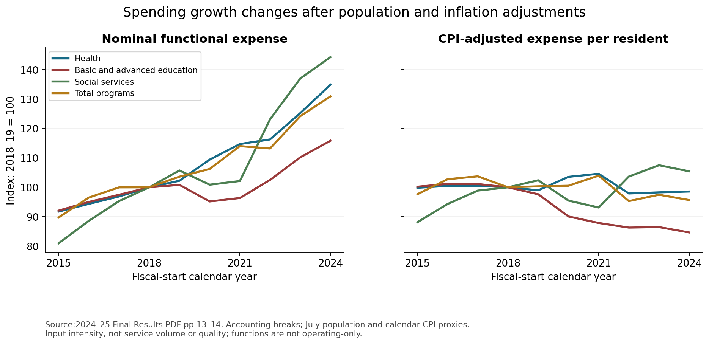

*Source:2024–25 Final Results PDF pp 13–14. Accounting breaks; July population and calendar CPI proxies. Input intensity, not service volume or quality; functions are not operating-only.*

Population rose from the source's July 2018 estimate of **4.293M to 4.889M in July 2024**, +13.9%. Chaining rounded calendar-year Alberta CPI growth gives a 2018→2024 price increase of **20.1%**. Keeping input intensity constant under these two proxies would require approximately **36.8%** nominal growth—the product of population and price ratios, not the sum of their percentages.

|Function|Nominal expense growth|CPI-adjusted expense/resident change|
|---|---:|---:|
|Health|+34.8%|-1.4%|
|Basic and advanced education|+15.8%|-15.3%|
|Social services|+44.2%|+5.4%|
|Other programs|+35.8%|-0.7%|
|Total programs|+30.9%|-4.3%|
|Debt servicing|+63.1%|+19.2%|
|Total expense|+31.7%|-3.7%|

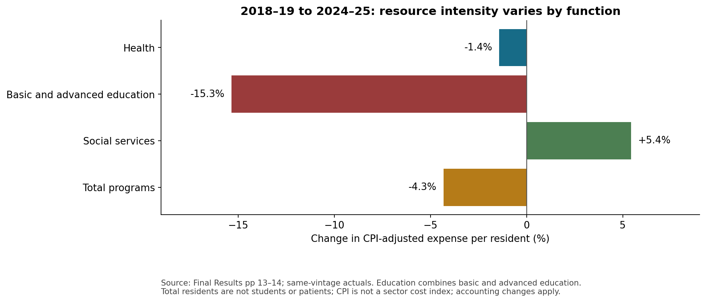

*Source: Final Results pp 13–14; same-vintage actuals. Education combines basic and advanced education. Total residents are not students or patients; CPI is not a sector cost index; accounting changes apply.*

Health's approximately 1.4% decline in this sensitivity is small relative to the limitations of the price, population and accounting proxies; do not characterize it as a precise reduction in care. Education's larger decline concerns **combined basic and advanced education per total provincial resident**, not K–12 spending per student. Enrolment, post-secondary participation, student needs and sector-specific costs require separate denominators. Social-services expense growth does not itself establish lower poverty or reduced housing need.

**The source expressly warns that numbers are not strictly comparable because of numerous accounting policy changes**, including 2019–20 and 2021–22 functional reclassifications after reorganizations. One latest vintage improves consistency but does not remove those breaks. Alternative 2015 and 2019 baselines are available in the exported comparison table; they change magnitudes. For example, health's adjusted per-resident endpoint difference is approximately −1.3% against 2015, −1.4% against 2018 and −0.4% against 2019. These comparisons should not be converted into causal party rankings.

Functional expense also differs from ministry operating expense. In 2024–25 Ministry of Health operating expense was **$25.669B**, while the health function was $29.560B. Education plus Advanced Education ministry operating expenses totaled $15.896B, below combined functional expense of $17.197B. These are overlapping accounting views, so adding them double-counts resources. The entire Capital Plan must not be added to consolidated expense either: capital grants can already be expensed, while capital investment is capitalized and amortized.

The final-results report's paired budget column shows total expense of **$73.182B budgeted versus $74.149B actual**, and operating expense of $60.124B versus $62.025B. These are budget figures **as reproduced/reclassified in Final Results**, not independently recovered original appropriations. A $2B contingency in the budget and $1.932B of actual disaster assistance illustrate why a zero standalone disaster budget does not imply there was no contingency provision. Budget variances are execution/accounting evidence, not automatic measures of effectiveness.

An independent parser audit found a **$6M inconsistency in the published 2022–23 functional table**: component expenses sum to $61.697B while the source reports program expense of $61.691B. Older vintages reconcile but contain different historical values. All published cells are preserved and the discrepancy is flagged; no category is silently repaired. It is approximately 0.010% of reported program expense and does not affect the 2018/2024 endpoint calculation. See the [financial definitions and audit](research/budget/SOURCE_DEFINITIONS_AND_AUDIT.md) and [independent reconciliation](review/functional_source_reconciliation.md).

## Health: gains in elective access alongside worsening urgent access

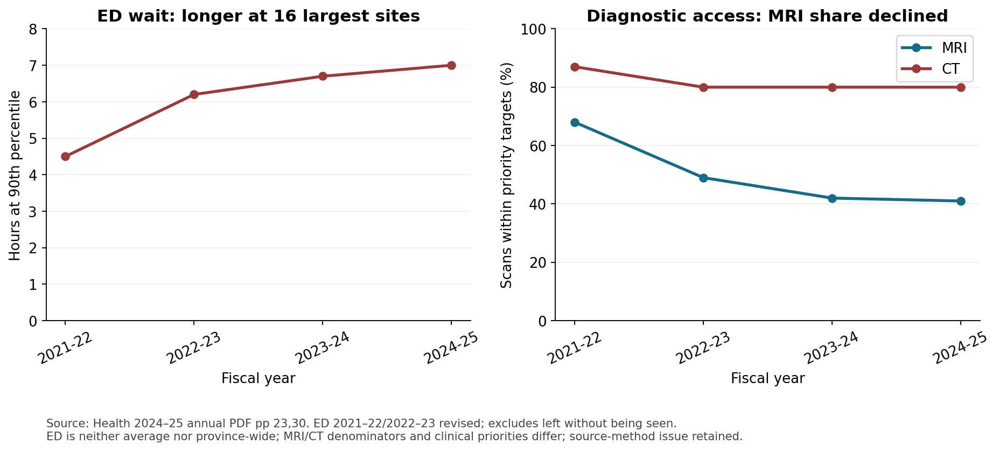

*Source: Health 2024–25 annual PDF pp 23,30. ED 2021–22/2022–23 revised; excludes left without being seen. ED is neither average nor province-wide; MRI/CT denominators and clinical priorities differ; source-method issue retained.*

The 2024–25 Health annual report supplies recent, same-vintage emergency and diagnostic series. The ED 90th percentile rose from **4.5 hours in 2021–22 to 6.2, 6.7 and 7.0 hours** in the following years. This measures initial physician assessment minus the earlier of registration/triage at the 16 largest sites, not an average or a province-wide all-hospital result. The first two values were revised to exclude patients who left without being seen. Do not splice this series into an older median-wait series covering 17 sites and different acuity groups.

The current report's ED methodology appendix contains an apparent copy-and-paste error using an EMS response paragraph. The outcome table/narrative and the preceding Health report's definition support the ED interpretation. The audit retains this source problem instead of repeating the erroneous methodology as fact. Diagnostic results likewise concern **shares of scans within priority-specific clinical time targets**, not total machines or raw scan counts. MRI's latest share fell to 41%, while CT remained at 80% after earlier deterioration. Different priority mixes can change these percentages.

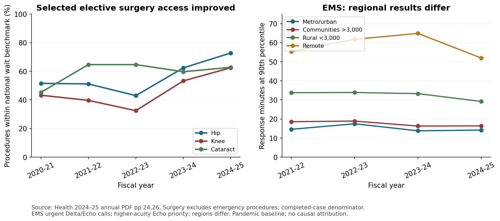

*Source: Health 2024–25 annual PDF pp 24,26. Surgery excludes emergency procedures; completed-case denominator. EMS urgent Delta/Echo calls; higher-acuity Echo priority; regions differ. Pandemic baseline; no causal attribution.*

Selected elective surgery results improved in 2024–25: hip +10.4 percentage points, knee +9.2 and cataract +3.1 against 2023–24. These national-benchmark percentages are calculated among people whose elective procedures occurred; emergency surgery and those still waiting are outside that denominator. Improvement is useful evidence of access gains, but cannot establish that the whole waiting list was served promptly. The pandemic-era starting points are unusually disrupted and are not an unconfounded counterfactual.

The report records approximately **318,601 surgeries versus 304,595 in the prior year**, exceeding its 310,000 volume target. This is procedures, not unique patients. The whole-government source notes volumes are estimates pending detailed chart reconciliation. Dividing by the same July population proxy gives approximately **65.17 versus 65.01 procedures per 1,000 residents**: throughput rose 4.6% in total but only about 0.2% per resident. Neither measure adjusts for age, case mix or the amount of unmet need.

EMS illustrates distribution: 90th-percentile urgent-call response worsened in metro/urban areas from **13.8 to 14.2 minutes** and communities above 3,000 from 16.3 to 16.4, while rural areas below 3,000 improved from 33.3 to 29.2 and remote areas from 64.9 to 52.0. Those are different geographies and call/service conditions, not interchangeable benchmarks. The source includes urgent Delta/Echo calls and prioritizes the highest-acuity Echo calls. A single provincial average would hide material regional differences.

Unplanned medical readmissions within 30 days were **12.7% in both 2023–24 and 2024–25**, after 13.2% in 2020–21. This is a separate quality-related measure, excluding categories such as surgery, pregnancy, mental health, palliative care and cancer. Its stable recent result should accompany the access findings.

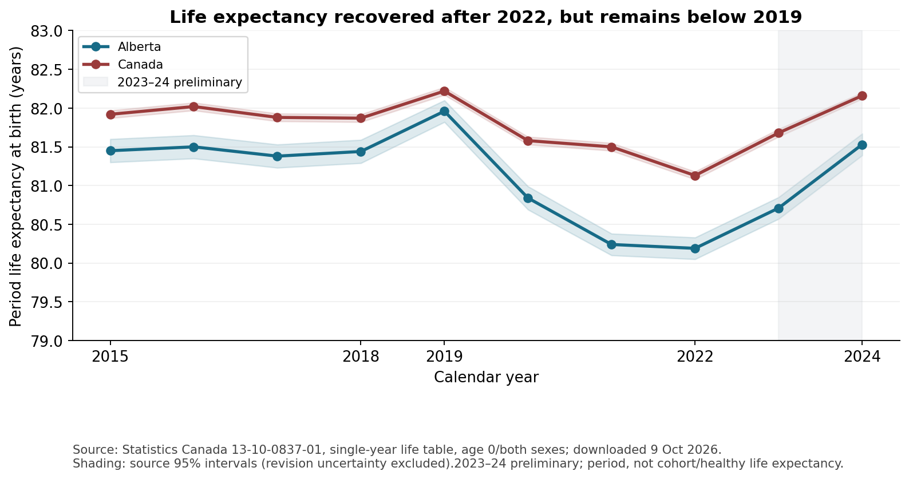

*Source: Statistics Canada 13-10-0837-01, single-year life table, age 0/both sexes; downloaded 9 Oct 2026. Shading: source 95% intervals (revision uncertainty excluded).2023–24 preliminary; period, not cohort/healthy life expectancy.*

A newly downloaded direct source fills the recent mortality gap: **Statistics Canada Table 13-10-0837-01**, complete single-year life tables, age 0/both sexes, released 13 January 2026. Alberta's period life expectancy was 81.44 years in 2018,81.96 in 2019,80.19 in 2022,80.71 in 2023 and 81.53 in 2024. This documents recovery after 2022 but a 0.43 year shortfall against 2019; against 2018, the 2024 point is 0.09 year higher, illustrating baseline sensitivity. Canada's 2024 estimate was 82.16 years. The 2023/2024 results are **preliminary according to metadata**, even though their raw CSV status fields are blank. Shading shows the source's 95% margins of error (Alberta 2024±0.14 years), which do not cover future revisions. These are period estimates under the age-specific mortality rates of each year, not forecasts of actual newborn-cohort survival or healthy-life years. No causal or new statistical-significance claim is made. Older provincial AHCIP life-expectancy vintages have major unreconciled differences and are kept separate, rather than appended to this current Statistics Canada series. See [life-table source audit](research/health/LIFE_EXPECTANCY_AUDIT.md).

There is now verified evidence that some infrastructure became operational, beyond mere spending announcements. Health 2023–24 reports the Misericordia replacement ED opened **21 November 2023**, with treatment rooms 26→64 and acute spaces 12→18. These are local facility capacities, not staffed provincial acute-bed growth. The 2024–25 report dates the Calgary cancer centre's full operation to 28 October 2024 and a second Rocky Mountain House operating room toApril 2024. Such outputs make the resource-to-service chain more concrete, but still do not establish population health improvement or complete net capacity after closures.

Continuing-care outcomes moved from Health to Seniors, Community and Social Services. SCSS 2024–25 now reports **63.0% of admitted clients placed within 30 days**, below its 66.0% target; the result is preliminary, and the prior 62.5% is incomplete because of Connect Care reporting gaps. The admitted-client denominator excludes people still waiting and cannot be joined to later counts of people waiting in selected hospitals. Missing Health data following a ministry transfer does not mean zero delivery. See [Health source definitions](research/health/health_source_audit.md), the [continuing-care metric bridge](research/health/continuing_care/recent_extension.md) and [current SCSS caveats](research/health/continuing_care/scss_bridge.md).

## Education: completion and achievement tell different stories

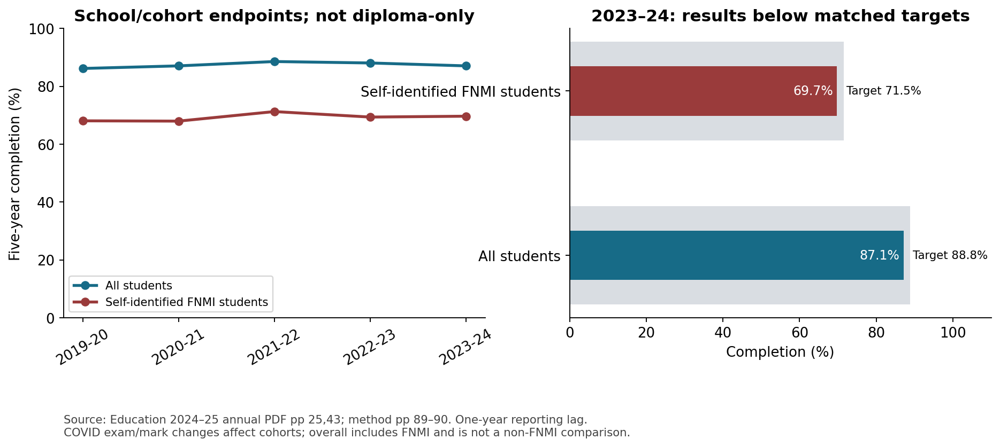

*Source: Education 2024–25 annual PDF pp 25,43; method pp 89–90. One-year reporting lag. COVID exam/mark changes affect cohorts; overall includes FNMI and is not a non-FNMI comparison.*

The 2024–25 Education annual report provides **2023–24 school/cohort completion**, with a one-year reporting lag. Five-year completion increased 0.9 percentage points from 86.2% in 2019–20 to 87.1%, but fell 1.5 points from the 2021–22 peak. The latest matched target was 88.8%, a 1.7 point shortfall. Completion includes credentials and certain other qualifying post-secondary/apprenticeship or course-credit pathways; it is not diploma-only graduation.

Self-identified First Nations, Métis and Inuit(FNMI) completion was **69.7%**, below its 71.5% target. The 17.4 point difference from 87.1% overall is **overall minus FNMI**, not a non-Indigenous-minus-Indigenous gap: the overall population includes the subgroup. Self-identification, cohort attrition and eligibility also matter. These results document an equity concern within the measure's scope without describing every Indigenous student's experience.

COVID exam cancellations, optional examinations and temporary diploma-exam weighting changes affected cohorts. Five-year endpoints combine years of exposure, so assigning each endpoint wholly to the government in office in the final year would be misleading. Increased completion is valuable but does not independently demonstrate improved tested learning.

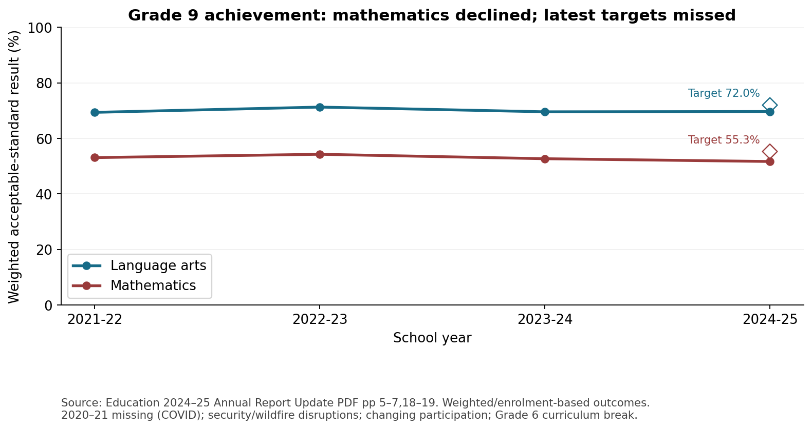

*Source: Education 2024–25 Annual Report Update PDF pp 5–7,18–19. Weighted/enrolment-based outcomes. 2020–21 missing (COVID); security/wildfire disruptions; changing participation; Grade 6 curriculum break.*

The later **Annual Report Update** supplies 2024–25 Grade 9 provincial achievement results: mathematics 51.7% against 55.3% target and language arts 69.7% against 72.0%. The respective shortfalls are 3.6 and 2.3 percentage points. Mathematics declined from 53.1% in 2021–22 while language arts was comparatively stable at 69.4→69.7%. These are weighted/enrolment-based source results; do not call 51.7% the percentage of all Alberta students, or assume it is a simple pass rate among exam writers.

Participation changed: mathematics 83.0→85.3% and language arts 82.3→85.2%. COVID caused missing 2020–21 results, a security incident affected 2021–22 coverage and wildfires affected 2022–23 participation. Missing observations are not zeros. Grade 6 curriculum changes prevent a consistent combined Grade 6/9 aggregate for 2024–25. Neither old Grade 12 language-arts diploma results nor PISA scores are spliced into the Grade 9 series. Exact sources, targets and method caveats are in the [current education audit](research/education_safety/CURRENT_EDUCATION_AUDIT.md).

## Economic living standards: job totals and nominal pay are incomplete

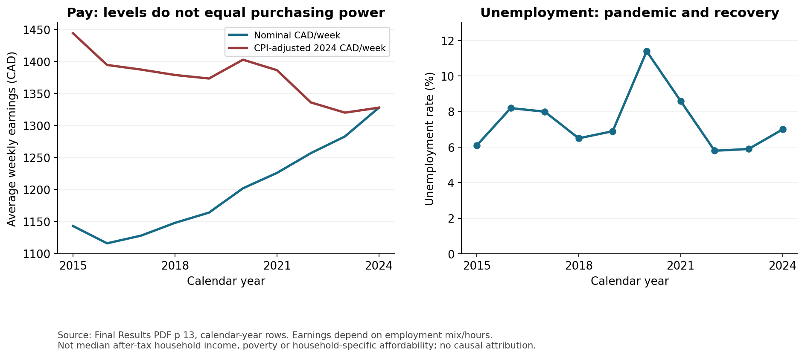

*Source: Final Results PDF p 13, calendar-year rows. Earnings depend on employment mix/hours. Not median after-tax household income, poverty or household-specific affordability; no causal attribution.*

Average weekly earnings in the final-results economic table rose from **$1,148 in 2018 to$1,328 in 2024**, +15.7%. Rounded annual CPI growth compounded by 20.1% over that period, giving an approximately **3.7% decline in CPI-adjusted average weekly earnings**. Against 2019 the decline is 3.3%, and against 2015 it is 8.0%. These are consistent calendar-year purchasing-power sensitivities, not a fiscal-year inflation correction.

Employment totals grew from 2.279M to 2.519M between 2018 and 2024. That is not an employment-rate increase: total population grew faster, but total population is itself the wrong denominator for the official working-age employment rate. Unemployment rose from 6.5% to 7.0%; the source shows the 11.4% pandemic peak in 2020. Unemployment is a share of the labour force, not a share of all Albertans or all people without jobs.

Weekly earnings depend on the jobs/hours represented in the source. They do not describe median household disposable income, taxes, transfers, household size or distribution. The table's 2024 **7.1% primary household-income growth is explicitly estimated and aggregate**. It is not final per-person after-tax income growth and is not used as an affordability verdict. Housing starts are construction outputs rather than rents, shelter-cost burden or homelessness. Status and units travel with exported economic values so estimated observations cannot be mistaken for final actuals.

The whole-government overview calls long-term unemployment “Improving” while stating that its share of unemployed people rose from 16% to 21% in 2023→2024. This is a source-label issue: a larger share remaining unemployed long-term is not treated here as an improvement simply because a positive label is printed. The detailed result must guide interpretation. Further household evidence is needed for median equivalized after-tax income, food insecurity, shelter costs relative to income, homelessness and results by income/region. See [living-standards sources and limitations](research/living_standards/README.md).

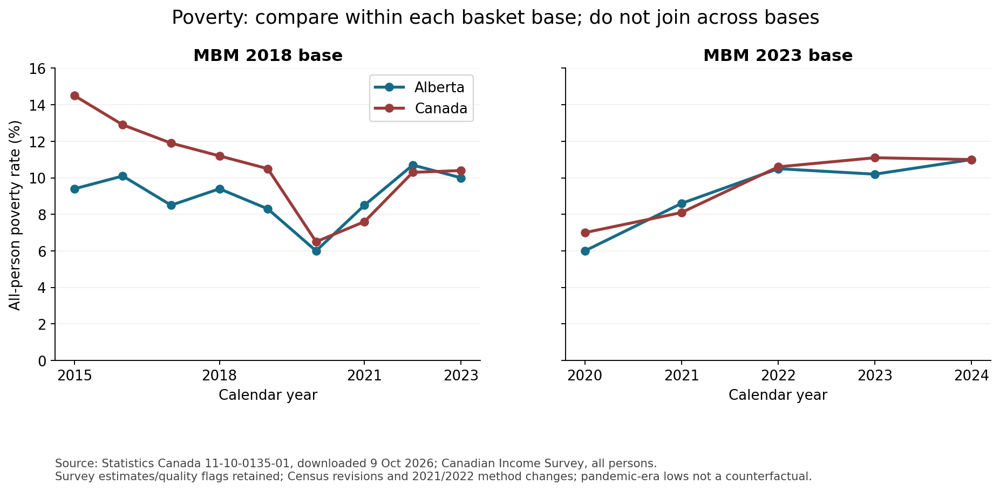

*Source: Statistics Canada 11-10-0135-01, downloaded 9 Oct 2026; Canadian Income Survey, all persons. Survey estimates/quality flags retained; Census revisions and 2021/2022 method changes; pandemic-era lows not a counterfactual.*

Direct poverty evidence is now available from **Statistics Canada Table 11-10-0135-01, Canadian Income Survey**, downloaded in this loop. Its two Market Basket Measure bases must be kept separate. On the latest 2023-base series, Alberta's all-person estimated poverty rate was **10.5% in 2022,10.2% in 2023 and 11.0% in 2024**. Canada's rounded 2024 point estimate was also 11.0%; this does not prove exact equality of population rates. Alberta's 2024 quality flag isB, “Very good” (coefficient of variation 2–4%); flags and definitions are preserved, but no significance test or new confidence interval is invented.

The 2018-base series has no 2024 observation in this download. It shows Alberta 9.4% in 2018 and 10.0% in 2023, while Canada 11.2→10.4%. A line joining 2018-base 2018 to 2023-base 2024 would mix basket definitions. The 2023-base series starts 2020; its pandemic-era low 6.0% is context, not a counterfactual for provincial policy. Statistics Canada revised 2018–2023 estimates using 2021 Census population counts and notes 2021/2022 income-data/sample/method changes. The data document estimated poverty incidence within source coverage; they do not identify the effects of Alberta's budget or every household's transition. The [poverty source audit](research/living_standards/MBM_POVERTY.md) retains exact rows, vectors, quality flags and metadata.

## Safety and mental health: retain opposing signals

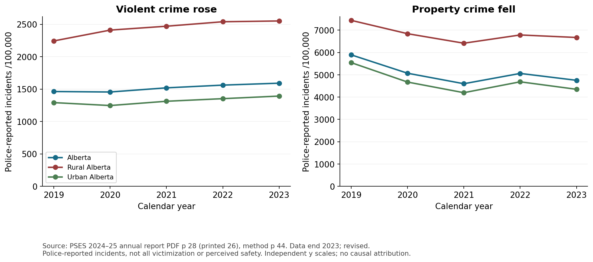

*Source: PSES 2024–25 annual report PDF p 28 (printed 26), method p 44. Data end 2023; revised. Police-reported incidents, not all victimization or perceived safety. Independent y scales; no causal attribution.*

The 2024–25 Public Safety and Emergency Services report's police-reported data end in **calendar 2023**, not fiscal 2024–25. Violent incidents rose 8.8% from 2019 while property incidents fell 19.4%. Rural rates exceed urban rates for both in this source, but the categories classify police-service areas, not every individual's residence. The definitions and annual revisions must travel with the values.

Crime severity uses weights reflecting seriousness and differs from raw incident rates. A falling overall index can coexist with more violent incidents. Whole-government and ministry summaries also quote slightly different rounded overall CSI declines; these are retained as a source reconciliation issue rather than used to declare a precise new change. Police data are not complete victimization or perceptions of safety; reporting and policing practices can affect measured incidence. These observations identify mixed safety conditions without attributing them to a budget line.

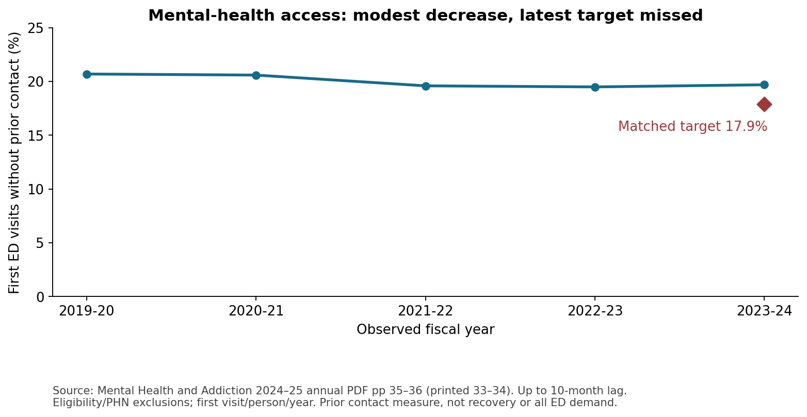

*Source: Mental Health and Addiction 2024–25 annual PDF pp 35–36 (printed 33–34). Up to 10-month lag. Eligibility/PHN exclusions; first visit/person/year. Prior contact measure, not recovery or all ED demand.*

Mental Health and Addiction's 2024–25 report provides an access indicator with an up-to-ten-month lag: first eligible ED visits without publicly funded mental-health/addiction service interaction in the previous two fiscal years. It fell 20.7→19.7% between 2019–20 and 2023–24, but rose from 19.5% in the latest year and exceeded the matched 17.9% target by 1.8 points. The denominator excludes invalid/missing health numbers and people with less than two years of AHCIP eligibility, limiting interpretation for recently arrived residents.

The measure assesses prior service contact among eligible ED users, not successful recovery, all unmet community need or the overall rate of emergency visits. The ministry reports other preliminary hospital indicators and an opioid-death reduction, but they require their underlying provisional-data/revision context before becoming an audited long-run welfare trend. Its recovery-supportive-community score was put on hold for methodological limitations, and an appropriate-level-of-care indicator was being replaced. These measurement gaps are themselves relevant when evaluating whether the recovery model is achieving its goals.

## Housing, gaps and the next test of success

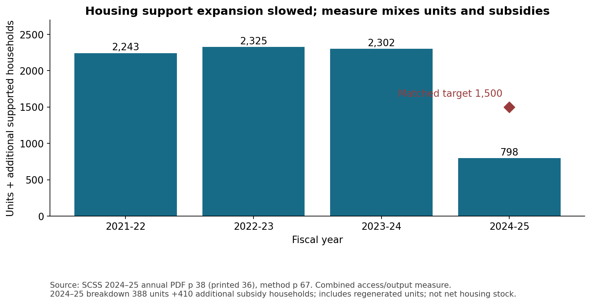

*Source: SCSS 2024–25 annual PDF p 38 (printed 36), method p 67. Combined access/output measure. 2024–25 breakdown 388 units +410 additional subsidy households; includes regenerated units; not net housing stock.*

The full government and SCSS reports provide an important housing distinction: the 2024–25 value of **798 combines new affordable housing units and new rental subsidies**; it must not be reported as 798 newly built homes. SCSS splits it into 388 units and 410 additional rent-supported households, against a matched combined target of 1,500. The same combined series was 2,243,2,325 and 2,302 in 2021–22,2022–23 and 2023–24. It includes newly built, refurbished/upgraded units and additional rent-supported households. A declining new-support flow does not establish a decline in total supported stock; rising individual benefits can preserve existing households while limiting expansion. Pipeline projects are not delivered housing, and neither new-support counts nor housing starts establish lower shelter-cost burden.

There are also concrete access gains that should remain in the assessment. SCSS reports median **AISH medical adjudication time of 5.3 weeks in 2024–25**, below its 9-week target, although longer than 4.3 weeks in 2023–24. Timing begins after a **complete application**, not first contact or initial submission; the result measures one administrative step rather than financial adequacy or poverty reduction. Jobs, Economy and Trade reports an average **$15/day licensed childcare fee for children up to kindergarten age as ofJanuary 2024**, under the federal-provincial agreement, and 142,700 licensed spaces in this scope atMarch 31,2025, including 14,300 new spaces. That is a defined childcare fee/access observation, not affordability for every family. The broader licensed-space indicator includes out-of-school care, so its growth percentage has a different denominator. An announced flat monthly fee startingApril 1,2025 falls outside this fiscal observation cutoff and is not scored as 2024–25 delivery.

This assessment has recovered recent government outcome reports and resolved several earlier “missing recent data” gaps. The remaining gaps should direct the next iteration:

|Priority|Evidence required|Why it can change the assessment|
|---|---|---|
|Direct welfare outcomes|Food insecurity, housing cost burden, life satisfaction and healthy life expectancy; fuller same-base poverty history/distribution and causes of mortality|Tests whether residents' lives improved beyond spending and selected service metrics|
|Demand-adjusted service inputs|K–12 enrolment/needs; age/case-adjusted health demand; staffing/FTE/active practice; sector prices|Separates population/price pressure from changes in service resources and need|
|Recent coverage and revisions|2025–26 actual fiscal results, current crime observations, consistent outcome revisions and ministry-transfer bridges|Updates the observation window without confusing forecasts, source vintage and actuals|
|Distribution|Matched results by income, region, age, disability and Indigenous status with appropriate governance/eligibility|Tests who benefits and whether averages hide widening gaps|
|Program attribution|Program exposure and actual implementation dates, matched outcomes, other funding, counterfactual/comparison design|Needed to evaluate the effect of a specific budget intervention|

Government reports are sources to verify, not endorsements to repeat. Their status words, approximate figures, methods, targets and fiscal accounting can disagree. The $6M financial residual, ED appendix issue, long-term unemployment label and housing-unit/subsidy conflation illustrate why source verification changes the interpretation.

**Assessment: share with caveats.** The report supports specific observed successes and shortfalls within stated scopes. It does not support a province-wide causal quality-of-life verdict, an efficiency ranking or an aggregate score. The practical next step is to fill the direct-welfare and demand-adjusted gaps before drawing a stronger conclusion.

## Inspect and reproduce the evidence

The [executed notebook](Alberta_Budget_Quality_of_Life.ipynb) rebuilds derived tables and standalone figures from local source files. The [README](README.md) documents commands and environment requirements. [Source receipt](research/source_verification/SOURCE_RECEIPT.md) distinguishes current website downloads from archived supplied PDFs and records the HTTP-client diagnosis. Source PDFs, exact page text, hashes and row-level definitions are retained alongside the analysis.

The Data report-app runtime/preparer is unavailable here; this deliverable is repository Markdown, static figures and a notebook companion. It is not a hosted interactive report or a published site. Original tracked repository files and the completed Infrastructure Analysis artifacts were preserved.
