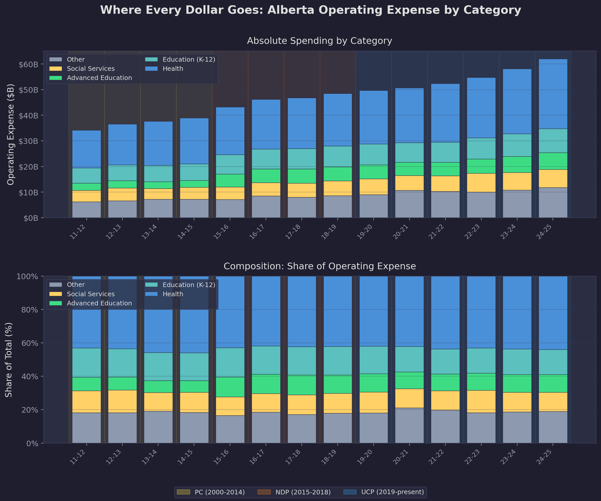
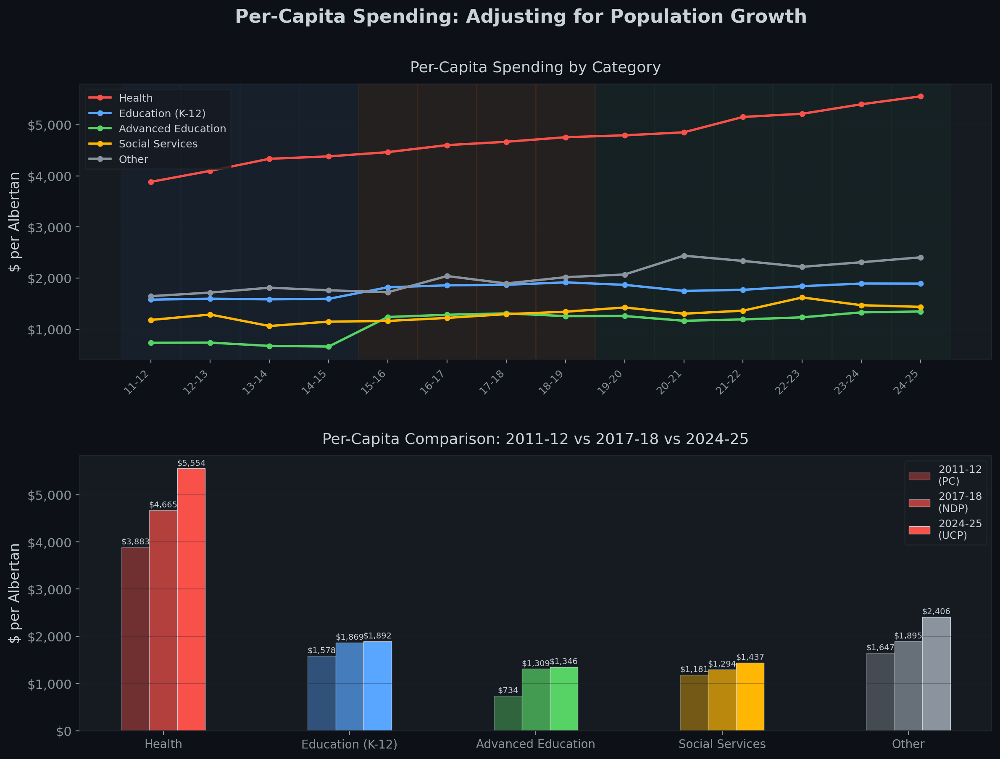
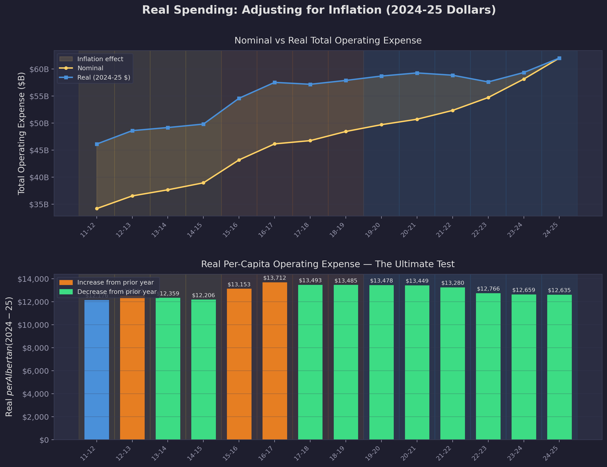
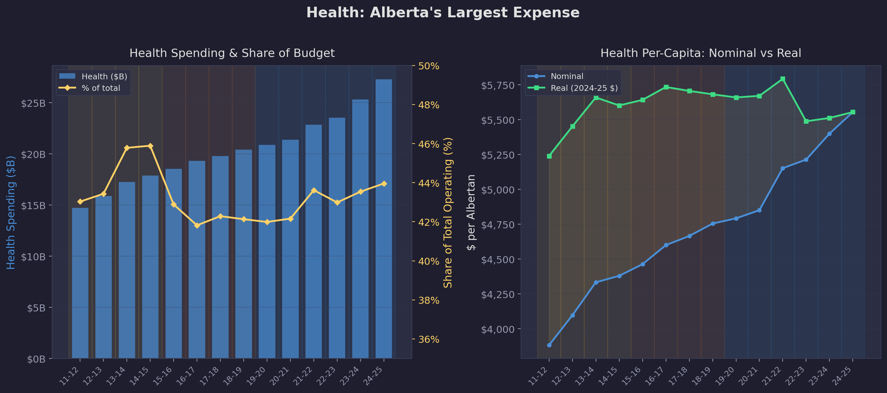

# wAlberta Budget Spending Analysis (2011-12 to 2024-25)

An in-depth analysis of **14 years** of Alberta provincial operating expenses, extracted from official budget PDFs and normalized into consistent spending categories across three governing parties (PC, NDP, UCP).

---

## 🔍 The Key Question

Alberta's operating budget grew from $34.2B to $62.0B (+81.5%) in 14 years. 
But how much of that is real growth, and how much is just population and inflation?

After adjusting for both, real per-capita spending only grew +3.8% over the entire period — from $12,176 to $12,635 per Albertan (in 2024-25 dollars).

After adjusting for both, real per-capita spending only grew **+3.8%** over the entire period, from **$12,176** to **$12,635** per Albertan (in 2024-25 dollars). 

That's roughly **$0.27/person/year** of real increase.

### 🧮 Quick Maths

Starting from the raw inputs extracted from budget PDFs and Statistics Canada:

| | 2011-12 | 2024-25 |
|--|---------|---------|
| Total Operating Expense | $34,175M | $62,026M |
| Population (StatsCan, July midyear) | 3,787,705 | 4,909,030 |
| Alberta CPI (2002=100) | 119.9 | 161.8 |

**Step 1 Inflation Adjustment** Converted to 2024-25 $:

```
deflator_2011 = CPI_2024 / CPI_2011 = 161.8 / 119.9 = 1.3494

Real spending_2011 = $34,175M x 1.3494 = $46,118M
Real spending_2024 = $62,026M x 1.0    = $62,026M  (already in 2024-25 $)
```

In constant dollars, spending grew from **$46.1B to $62.0B** (+34.5%) — not the 81.5%. 
Inflation is a big driver of this growth. 

**Step 2 Adjust for population** :

```
Real per-capita_2011 = $46,118M / 3,787,705 = $12,176 per person
Real per-capita_2024 = $62,026M / 4,909,030 = $12,635 per person
```

Alberta added **1.12 million people** over this period — a 29.6% increase. When you spread the budget across all those new Albertans, the per-person figure barely moves.

(In theory, per-capita costs should fall as the population grows.Serving 4.9 million people doesn't cost 29.6% more than serving 3.8 million. Fixed costs — IT systems, administrative overhead, regulatory bodies, capital infrastructure get amortized across a larger population base. A highway built for 3.8 million Albertans doesn't need to be rebuilt for 4.9 million.That's my 2 cents)

**Step 3 — The result:**

```
Change = ($12,635 / $12,176) - 1 = +3.8%
```

### 📉 What Ate the Other 77.7%?

| Factor | Contribution |
|--------|-------------|
| 💰 Inflation (CPI: 119.9 &rarr; 161.8) | **+34.9%** |
| 👥 Population growth (3.79M &rarr; 4.91M) | **+29.6%** |
| 📈 **Real per-capita increase** | **+3.8%** |
| **Combined** | **≈ 81.5%** |

Nearly all of the headline **$28B spending increase** is explained by there being more Albertans and each dollar buying less. Only ~3.8 percentage points represent a genuine increase in government services per person.

> **Note:** 2024-25 figures are budget estimates. The most recent audited actuals are from 2023-24 ($58.1B, real per-capita $12,401, **+1.8%** vs 2011-12).

---

## 📋 Key Findings

### 🏷️ The Headline Numbers

| Metric | 2011-12 | 2024-25 | Change |
|--------|---------|---------|--------|
| Total Operating Expense | $34.2B | $62.0B | +81.5% |
| Population | 3.79M | 4.91M | +29.6% |
| Real Per-Capita Spending (2024-25 $) | $12,176 | $12,635 | +3.8% |

### 💵 Where Every Dollar Goes

| Category | 2011-12 | 2024-25 | Nominal Growth | Budget Share |
|----------|---------|---------|----------------|-------------|
| 🏥 Health | $14.7B | $27.3B | +85% | 43.0% &rarr; 44.0% |
| 🎓 Education (K-12) | $6.0B | $9.3B | +55% | 17.5% &rarr; 15.0% |
| 🎓 Advanced Education | $2.8B | $6.6B | +138% | 8.1% &rarr; 10.7% |
| 🤝 Social Services | $4.5B | $7.1B | +58% | 13.1% &rarr; 11.4% |
| 📦 Other | $6.2B | $11.8B | +89% | 18.3% &rarr; 19.0% |

### 💡 Three Key Insights

1. **🏥 Health consumes 44 cents of every operating dollar** — and its share is still growing.
   - Per-capita health spending rose from $3,883 to $5,554 nominally
   - But after inflation? That's only a **6% real increase** over 14 years
   - COVID-19 pressures from 2019-20 onward drove a sharp acceleration
   - Health's share dipped slightly during the NDP era before climbing back under the UCP

2. **🎓 K-12 Education is losing ground** — its budget share fell from 17.5% to 15.0%
   - Nominal spending grew 55%, which sounds healthy
   - But population growth (+29.6%) and inflation (+34.9%) consumed almost all of it
   - On a real per-capita basis, K-12 funding has essentially flatlined
   - This raises questions about classroom sizes and per-student resources as Alberta's population booms

3. **🎓 Advanced Education saw the largest relative surge** at +138% nominal growth
   - Budget share jumped from 8.1% to 10.7%
   - Driven partly by post-secondary funding restructuring that shifted capital grants into operating budgets
   - The spike is most visible in the cumulative growth chart where Advanced Education outpaces every other category

### 🏛️ Spending Across Political Eras

The analysis spans three distinct governing parties:

- **🟡 Progressive Conservatives (2011-2014)** — Steady growth in the oil boom years, relatively flat real per-capita spending
- **🟠 NDP (2015-2018)** — Largest real per-capita spending, peaking at **$13,712/person** in 2016-17. Increased social spending and Climate Leadership Plan contributions
- **🔵 UCP (2019-present)** — Real per-capita spending declined from the NDP peak despite COVID-19 pressures. By 2024-25, real per-capita spending ($12,635) sits **below** where it was in 2015-16 ($13,153)

---

## 📈 Visualizations

### 1. Spending Composition


> Alberta's operating budget nearly doubled from $34B to $62B over 14 years.

- **Top panel:** Absolute spending growth by category — shows the raw dollar increase year over year
- **Bottom panel:** 100% stacked composition — reveals how each category's share shifts over time
- **Background shading** indicates governing party: 🟡 PC | 🟠 NDP | 🔵 UCP
- Notice how Health (blue) consistently dominates, while Education's share slowly shrinks

---

### 2. Per-Capita Spending


> Adjusting for Alberta's 29.6% population growth reveals a very different picture.

- **Top panel:** Per-capita line chart — Health per-capita accelerated sharply from 2019-20 onward, while K-12 barely kept pace
- **Bottom panel:** Grouped bar comparison of three political eras side by side (2011-12 PC vs 2017-18 NDP vs 2024-25 UCP)
- The grouped bars make it easy to see which categories each government prioritized per person

---

### 3. Inflation-Adjusted (Real) Spending


> The yellow shaded area in the top panel is the "inflation illusion" — money that buys less, not more services.

- **Top panel:** Nominal (yellow) vs Real (blue) total operating expense — the gap widens every year as cumulative inflation grows
- **Bottom panel:** Real per-capita spending with direction-colored bars
  - 🟠 **Orange bars** = year-over-year increase (spending grew faster than population + inflation)
  - 🟢 **Green bars** = year-over-year decrease (efficiency gains or spending restraint)
- Real per-capita spending peaked at **$13,712** in 2016-17 (NDP) and has fallen back to **$12,635** by 2024-25

---

### 4. Health Spending Deep Dive


> Health is Alberta's single dominant expense — consuming nearly half the operating budget.

- **Left panel:** Health spending bars + budget share line (yellow)
  - The share dipped during the NDP era before climbing back to 44% under the UCP
  - Absolute spending nearly doubled from $14.7B to $27.3B
- **Right panel:** Nominal vs Real health per-capita
  - In real terms, health spending per Albertan grew only **6%** over 14 years ($5,239 &rarr; $5,554)
  - The growing gap between the nominal and real lines shows how much inflation distorts the picture

---

### 5. Cumulative Growth by Category


> All categories indexed to 2011-12 = 100. Anything above the white (Population) and orange (CPI) lines represents real per-capita growth.

- **Advanced Education** (green) is the clear outlier — growing to ~240 by 2024-25
- **Health** and **Social Services** track closely until 2019-20, when Health pulls away due to COVID pressures
- **Education (K-12)** barely exceeds the Population line, meaning per-capita K-12 spending has been essentially flat
- The **CPI line** (orange dotted) shows the inflation baseline — anything growing slower than this is a real per-person cut

---

### 6. Fiscal Overview (Revenue vs. Expense)


> The broader fiscal context: Alberta's boom-bust resource revenue cycle.

- **Top panel:** Revenue vs Expense over 25 years (2000-01 to 2024-25)
- **Middle panel:** Surplus/deficit swings — Alberta has experienced both large surpluses and deep deficits
- **Bottom panel:** Non-renewable resource revenue volatility, which is the primary driver of Alberta's fiscal instability
- This context explains why spending growth has been constrained despite a fast-growing population

---

## 📚 Data Sources

| Source | Description |
|--------|-------------|
| [Alberta Budget Documents](https://open.alberta.ca/publications/budget) | 14 official budget PDFs (2011-12 to 2024-25) — ministry-level operating expense tables |
| [Statistics Canada Table 17-10-0009-01](https://www150.statcan.gc.ca/t1/tbl1/en/tv.action?pid=1710000901) | Alberta quarterly population estimates (midyear July values) |
| [Statistics Canada Table 18-10-0004-01](https://www150.statcan.gc.ca/t1/tbl1/en/tv.action?pid=1810000401) | Alberta CPI, All-items, annual average (2002=100) |

---

## 🔬 Methodology

### Ministry Normalization

Alberta restructures its ministries frequently. To enable meaningful comparison across 14 years, **~80+ raw ministry names** were mapped into **5 stable analytical categories**:

- 🏥 **Health** — Alberta Health, Alberta Health Services, Mental Health & Addiction
- 🎓 **Education (K-12)** — Education, including school capital and operations
- 🎓 **Advanced Education** — Advanced Education, post-secondary institutions, student aid
- 🤝 **Social Services** — Human Services, Children & Family Services, Community & Social Services, Seniors & Housing
- 📦 **Other** — Justice, Infrastructure, Transportation, Agriculture, Energy, Municipal Affairs, Environment, Treasury Board, Executive Council, and all remaining ministries

### Inflation Adjustment

All real (inflation-adjusted) figures use **Alberta-specific CPI** deflated to constant 2024-25 dollars:

```
Real Value = Nominal Value x (CPI_2024-25 / CPI_year)
```

This uses Alberta's own consumer price index rather than the national CPI, since provincial price levels can differ significantly from the national average.

### Extraction & Validation

Ministry-level data was extracted from budget PDFs using **pdfplumber word-level extraction** with x-coordinate column analysis:

- ✅ All 14 years validated against within-PDF "Total Operating Expense" rows (max deviation: **0.01%**)
- ✅ Cross-year prior-year actual comparisons verified
- ✅ Ground-truth checks against pre-extracted Excel data for 2023-25
- ✅ Special items handled: COVID-19 expenses (2019-23), Climate Leadership Plan (2016-19), Crude-by-rail (2019-22)

---

## 📁 Project Structure

```
Alberta Budget Analysis/
├── 📄 README.md
├── 📓 Alberta_Expense_Analysis.ipynb    # Main analysis notebook
├── 🐍 extract_ministry_expenses.py      # PDF extraction & normalization pipeline
├── 🐍 generate_fiscal_infographic.py    # Revenue/expense/surplus infographic
├── 📂 Data/
│   ├── alberta_surplus_deficit.csv      # 25-year fiscal summary
│   ├── ministry_expenses.csv            # Aggregated 5-category data
│   ├── ministry_expenses_detail.csv     # Individual ministry values
│   └── ministry_expenses_wide.csv       # Pivoted format (years x categories)
├── 📂 Budget PDFs/                      # 14 source PDFs (2011-12 to 2024-25)
└── 📂 plots/
    ├── expense_composition.png
    ├── expense_percapita.png
    ├── expense_real_spending.png
    ├── expense_health_deep_dive.png
    ├── expense_growth_indexed.png
    └── alberta_fiscal_summary_infographic.png
```

---

## ⚙️ Requirements

```
pandas
numpy
matplotlib
pdfplumber
```

---

## 📜 License

This project uses publicly available Government of Alberta budget data and Statistics Canada open data. Analysis and visualizations are original work.
